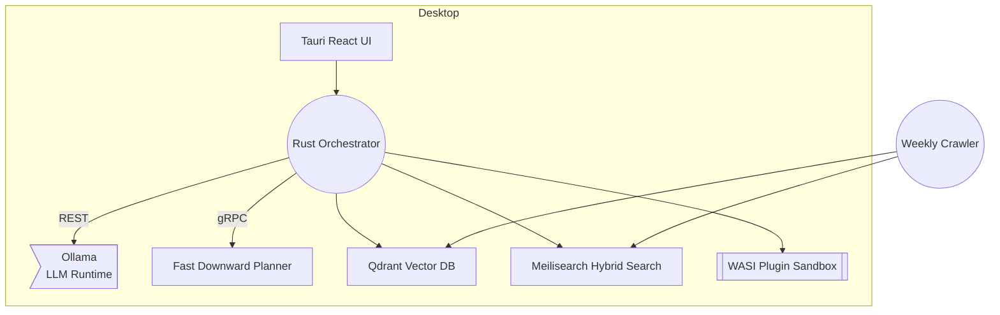

# Stack Composer

_Design once, build anywhere – an offline‑first AI assistant that generates a full, production‑ready technology stack from any project brief._

[](LICENSE)
[](https://github.com/your‑org/stack‑composer/actions)
[](https://github.com/your‑org/stack‑composer/releases)

---

## ✨ Key Features

| Capability                   | Summary                                                                                 |
| ---------------------------- | --------------------------------------------------------------------------------------- |
| **Local LLM Reasoning**      | Bundled 4‑bit `phi‑3` model via Ollama keeps your code & briefs private.                |
| **Hybrid Retrieval (RAG)**   | Qdrant vectors + Meilisearch BM25 for lightning‑fast, licence‑aware evidence.           |
| **Gap‑Analysis Agent**       | Automatically asks clarifying questions to close missing requirements.                  |
| **Symbolic Planner**         | Optional Fast Downward / HTN module sequences multi‑stage build & deploy flows.         |
| **WASI Plugin Sandbox**      | Extend behaviour safely with WebAssembly plugins, centrally curated & signed.           |
| **Weekly Ontology Refresh**  | Scheduled crawler pulls new release notes, CVEs, and SPDX data — 100 % offline‑capable. |
| **Cross‑Platform GUI & CLI** | Tauri shell + React UI; Rust CLI for pipelines and headless CI.                         |

---

## 🚀 Quick Start

```bash
# macOS / Linux / Windows (PowerShell)
curl -sSfL https://github.com/your-org/stack-composer/releases/latest/download/install.sh | bash
stack-composer ingest examples/ecommerce-brief.md
```

The app launches, asks you any missing questions, and generates a full tech‑stack report plus starter repo scaffold.

---

## 🖥️ System Requirements

- **CPU**: x86‑64 or Apple Silicon
- **RAM**: 4 GB minimum (8 GB recommended for larger models)
- **Disk**: ~2 GB for the default 4‑bit model + 500 MB for indexes
- Runs on Windows 10+, macOS 11+, and modern Linux (glibc ≥ 2.31).

---

## 📦 Installation

| Platform                   | Command                                                                                                                |
| -------------------------- | ---------------------------------------------------------------------------------------------------------------------- |
| **Homebrew (macOS/Linux)** | `brew tap your‑org/tap && brew install stack‑composer`                                                                 |
| **Scoop (Windows)**        | `scoop bucket add your‑org https://github.com/your‑org/scoop‑bucket.git && scoop install stack‑composer`               |
| **Manual**                 | Download the `.dmg`, `.msi`, or AppImage from the [releases page](https://github.com/your‑org/stack‑composer/releases) |

> **Note:** first launch downloads the default Ollama model if not present.

---

## 🛠️ Usage

```bash
# Launch GUI
stack-composer

# Headless: generate a tech stack JSON report
stack-composer ingest brief.md --output stack.json
```

Add `--planner` to enable PDDL planning, or `--model phi-3-large` to pull a bigger model.

---

## 🏗️ Architecture Overview



---

## 🔌 Plugins

1. Clone `plugins/hello-world`.
2. `cargo wasi build --release`.
3. Install via **Settings → Plugins → Add** or `stack-composer plugin install ./target/wasm32-wasi/release/hello.wasm`.

---

## 📝 Documentation

| Doc                             | Description                   |
| ------------------------------- | ----------------------------- |
| `docs/quickstart.md`            | 5‑minute guide                |
| `docs/architecture-overview.md` | Deep dive diagrams            |
| `docs/planner-integration.md`   | Using Fast Downward & OPTIC   |
| `docs/plugin-sdk/`              | Develop WASI plugins          |
| `adr/`                          | Architecture Decision Records |

---

## 🗺️ Roadmap

- **v0.5** – MVP (GUI + CLI, RAG, report export)
- **v1.0** – Ontology auto‑update, plugin SDK, signed installers
- **v1.1** – Homebrew & Scoop channels, telemetry dashboard
- **v2.0** – Mobile (Tauri‑Mobile) & PWA clients, team collaboration

---

## 🤝 Contributing

We welcome PRs! See [`CONTRIBUTING.md`](CONTRIBUTING.md) to get started.
Please abide by our [Code of Conduct](CODE_OF_CONDUCT.md).

---

## 🧹 Git Pre-commit Hook

To keep your repo clean of macOS dotfiles (AppleDouble, .DS_Store, etc.), a pre-commit hook script is provided:

```bash
cp scripts/pre-commit .git/hooks/pre-commit
chmod +x .git/hooks/pre-commit
```

This will automatically delete unnecessary files before every commit. Re-run after cloning or if hooks are reset.

---

## 🛡️ License

Copyright © 2025 **Your Organisation**.  
Released under the **Apache License 2.0**. See [LICENSE](LICENSE) for details.
