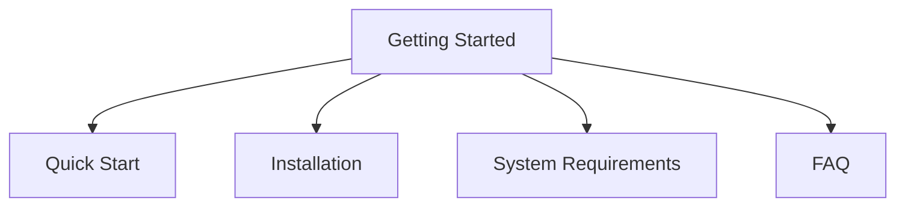

# Getting Started

Welcome to Stack Composer! This section will help you get up and running quickly, whether you’re a new user or setting up a fresh environment.

## Section Structure

## Key Guides

- [Quick Start](./quickstart.md): Step-by-step guide to your first Stack Composer experience.
- [Installation](../installation.md): How to install Stack Composer on your system.
- [System Requirements](./system-requirements.md): Minimum and recommended requirements.
- [FAQ](../faq.md): Frequently asked questions and troubleshooting tips.

---

**Next Steps:**

- Explore the [User Guides](../configuration.md) for more advanced usage.
- Learn about [Extensibility](../plugin-sdk/README.md) to customize your experience.
