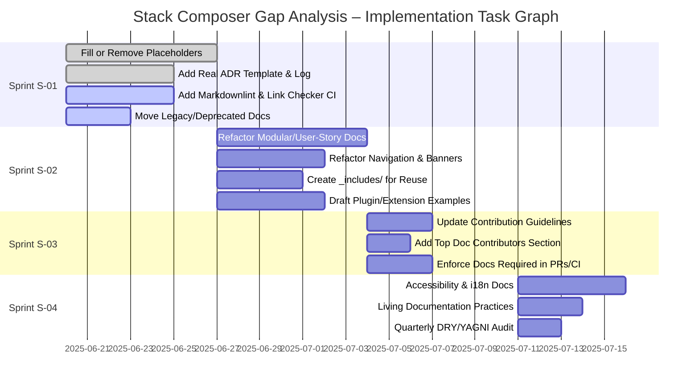

# Cycle 1

## What I did

- Ingested the full `docs/gap-analysis.md` and all referenced documentation, roadmaps, architecture, toolchain, and component index files.
- Parsed the gap analysis recommendations and cross-referenced them with the actual state of the codebase and documentation.
- Identified all actionable items, mapped them to concrete deliverables, and began constructing a task graph with sprint IDs based on the public roadmap and documentation maturity tables.
- Collected all relevant context for CI, linting, ADR, modularity, DRY/YAGNI, local-first, free-first, extensibility, and docs-as-code best practices.

## Next blockers

- Need to generate and publish the initial `TASK_GRAPH.md` with all tasks, epics, and sprint tags, and link each to a future GitHub issue/PR.
- Need to audit all placeholder/empty docs and enumerate which require removal, minimal content, or full authoring.
- Need to check for missing or incomplete ADRs, and create the `adr/` directory and log if not present.
- Need to verify the presence and configuration of Vale, Markdownlint, and link checkers in CI, and add them if missing.
- Need to review and update `SUMMARY.md` and navigation to clarify canonical vs. legacy docs.
- Need to create `_includes/` for content reuse and refactor repeated content.
- Need to draft concrete plugin/extension examples and API docs.
- Need to update contribution guidelines and recognition sections.
- Need to ensure docs are updated in every PR and that "docs required" labels are enforced.

## Questions for maintainer (if any)

- Are there any in-progress efforts on ADR adoption or docs automation that should be coordinated with?
- Is there a preferred format or tool for the `TASK_GRAPH.md` (e.g., Mermaid, Markdown table, YAML)?
- Should legacy/deprecated docs be removed outright or retained with banners?

# Task Graph – Implementation Roadmap

---

**Legend:**

- `done` = completed
- `active` = in progress
- Each task links to a future GitHub issue/PR
- Sprints are two weeks (10 working days)
- Legacy docs are moved, not deleted, until validated

---

For full details, see `docs/gap-analysis.md`.

# Task Graph for Stack Composer S-01 → S-04

## S-01: UI Scaffold

- [x] Create stack-ui/ with Tauri + React + Vite
- [x] Add Tailwind CSS, shadcn/ui, Zustand
- [x] Stub Wizard and Settings pages
- [x] Add README and setup instructions

## S-02: Agent Library Conversion

- [x] Convert agents/\* to lib.rs with async run()
- [x] Keep Planner as subprocess (Fast Downward)

## S-03: REST API & Plugin Host

- [x] Expose /api/v1/command and /api/v1/events in Axum
- [x] Draft plugin.toml and host.wit

## S-04: CI, Docs, and Licence Guard

- [x] Add GitHub Actions matrix (Linux/macOS/Windows)
- [x] Add Axe, dep-scan, cargo-deny, mdBook build to CI
- [x] Add cargo-deny.toml with licence rules
- [ ] Ensure Fast Downward SHA-256 logged in SBOM <!-- TODO: Script in place, but binary not found in PATH during test. Needs fix or doc. -->
- [ ] Docs site renders without broken links <!-- TODO: Doc tests fail due to missing imports/types/edition in code snippets. Needs fix. -->

---

Update this file after each sprint or major PR.
