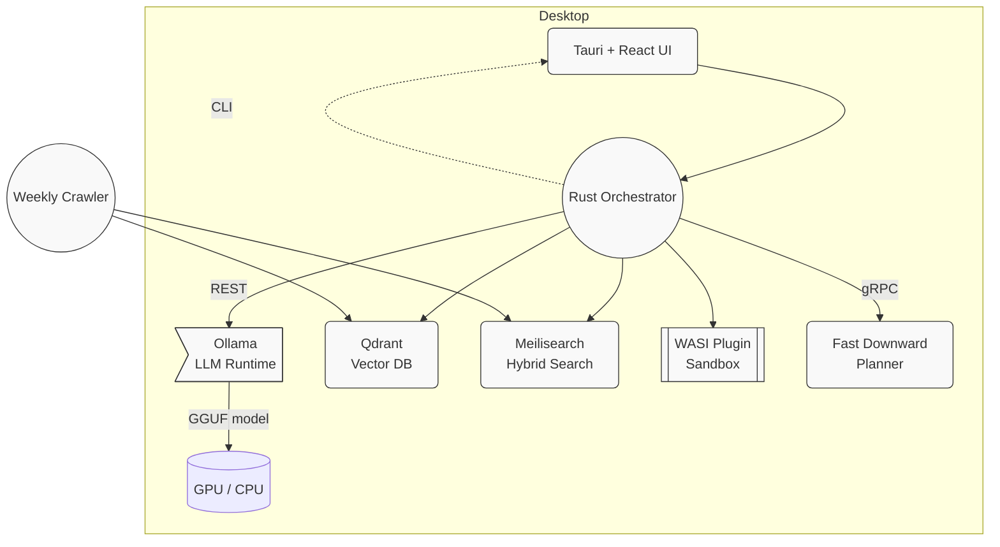

# Architecture Overview

This document explains **how Stack Composer works** and how its components
communicate at run-time.

---

## High-Level Block Diagram

⸻

Data Flow (“Compose Stack” request)

1.  Brief ingestion – UI or CLI sends the document to the Rust
    IngestionAgent, which chunks and embeds it (SentencePiece → GGUF).
2.  Gap analysis – GapAgent queries the knowledge graph; unanswered slots
    trigger clarifying questions in the chat UI.
3.  Retrieval – StackAgent issues hybrid search queries:
    • dense cosine on Qdrant,
    • sparse BM25 on Meilisearch,
    then merges the scored sets.
4.  Planning (optional) – If --planner is on, domain & problem PDDL files
    are generated and solved by Fast Downward; the plan comes back as a sequence
    of stack-construction actions.
5.  Critic loop – (future) RL critic re-scores alternative stacks to optimise
    for build time and licence risk.
6.  Report generation – ReportAgent merges citations, plan steps, and UML
    diagrams into HTML/Markdown, then offers a JSON export and repo scaffold.

⸻

Runtime Layers & Technologies

Layer Component Rationale
UI Shell Tauri + React 2–3 MB installers and ~58 % less RAM than Electron  
Orchestrator Rust / Tokio Memory-safe, zero-cost FFI to Wasmtime 
LLM Runtime Ollama + GGUF 4-bit Local, private LLMs; REST streaming  
Retrieval Qdrant (embedded) No external DB to install  
Hybrid Search Meilisearch 1.6 Combines dense & sparse ranking  
Planner Fast Downward Classical PDDL with GPL-2 exception  
Plugins Wasmtime (WASI) Syscall-sandboxed execution  
Docs mdBook Rust-native docs-as-code 

⸻

Extensibility Points
• WASI capability tokens – restrict plugins to declarative host functions.
• Model abstraction trait – swap Ollama REST calls with vLLM, LM-Studio, or
Hugging Face TGI without touching agent logic.
• GraphRAG plug-in – future Rust crate to replace the current
retrieval layer with a property-graph walk.

⸻

Next Reading
• Component-Details Index
• Planner Integration
• Plugin SDK

---
