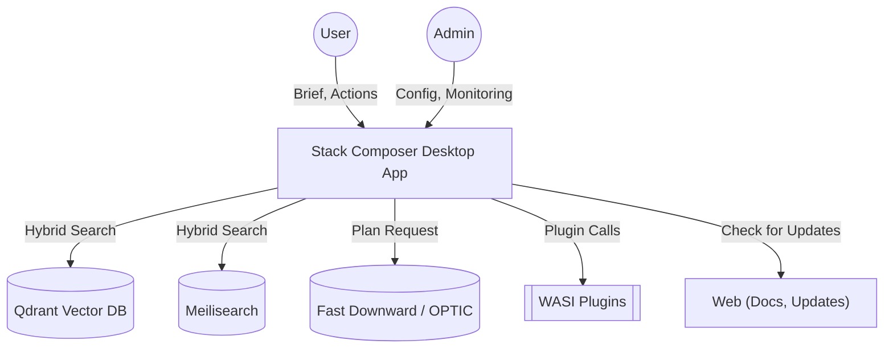
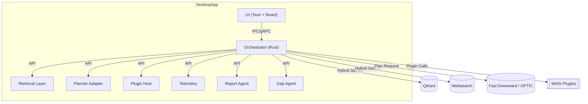

# Architecture Overview

> **Developer Environment:** For details on the required toolchain, reproducible setup, and all supporting tools (Rust, Node, Docker, Nix, Qdrant, Meilisearch, etc.), see [Toolchain & DX Pipeline](../toolchain.md) and [Developer Setup](../Developer & Extensibility Docs/dev-setup.md).

This document explains **how Stack Composer works** and how its components communicate at run-time.

---

## C4 Context Diagram

**Responsibilities:**

- Stack Composer ingests briefs, interacts with users/admins, and orchestrates retrieval, planning, and plugin execution.
- External dependencies: Qdrant, Meilisearch, planners, plugins, and web resources.
- Data flows: User input → Stack Composer → retrieval/planning/plugins → output (report, scaffold, telemetry).

---

## C4 Container Diagram

---

**Next Steps:**

- Explore the [AI Platform Overview](AI Platform Overview.md)
- Review [Component Details](../extensibility/component-details.md)
- See [Operations Guide](../operations-security/ops-guide.md)
