# Documentation Site Map

```mermaid
flowchart TD
    A[Welcome / README] --> B1[Getting Started]
    B1 --> B2[Quick Start]
    B1 --> B3[Installation]
    B1 --> B4[FAQ]
    A --> C1[User Guides]
    C1 --> C2[Configuration]
    C1 --> C3[Usage Guide]
    C1 --> C4[Troubleshooting]
    A --> D1[Extensibility]
    D1 --> D2[Plugin SDK]
    D1 --> D3[Component Details]
    A --> E1[Architecture & Roadmap]
    E1 --> E2[Architecture Overview]
    E1 --> E3[AI Platform Overview]
    E1 --> E4[Roadmap]
    E1 --> E5[ADRs]
    A --> F1[Operations & Security]
    F1 --> F2[Operations Guide]
    F1 --> F3[Telemetry & Privacy]
    F1 --> F4[Security Policy]
    F1 --> F5[Release Process]
    A --> G1[Community & Contribution]
    G1 --> G2[Contributing]
    G1 --> G3[Contributing to Docs]
    G1 --> G4[Code of Conduct]
    G1 --> G5[Governance]
```

---

This diagram shows the high-level structure and navigation flow of the Stack Composer documentation. Each node links to a major section or guide.

- For more details, see the sidebar or [SUMMARY.md](SUMMARY.md).
- Use the search bar or sidebar to quickly find any topic.
