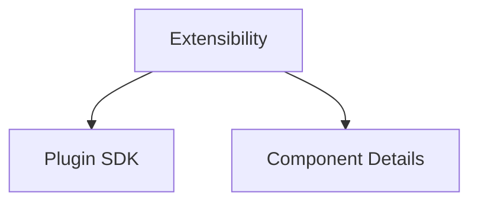

# Extensibility

Learn how to extend Stack Composer with plugins and custom components.

## Section Structure

## Key Guides

- [Plugin SDK](../plugin-sdk/README.md): Build and integrate plugins.
- [Component Details](../component-details/README.md): Deep dives into extensible components.

---

**Next Steps:**

- See [Architecture & Roadmap](../architecture-overview.md) for system design.
- Visit [Community & Contribution](../CONTRIBUTING.md) to get involved.
