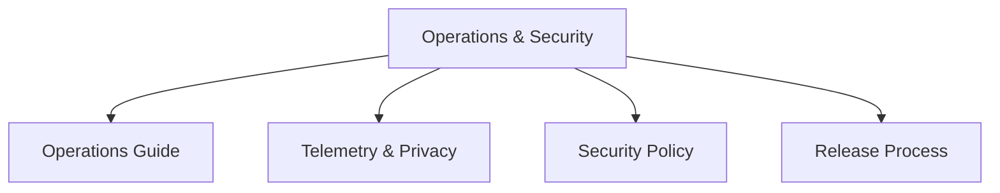

# Operations & Security

Guides for deploying, operating, and securing Stack Composer in production environments.

## Section Structure

## Key Guides

- [Operations Guide](../ops-guide.md): Running and maintaining Stack Composer.
- [Telemetry & Privacy](../telemetry-privacy.md): Data collection and privacy.
- [Security Policy](../security-policy.md): Security practices and policies.
- [Release Process](../release-process.md): How releases are managed.

---

**Next Steps:**

- See [Architecture & Roadmap](../architecture-overview.md) for system design.
- Visit [Community & Contribution](../CONTRIBUTING.md) to get involved.
