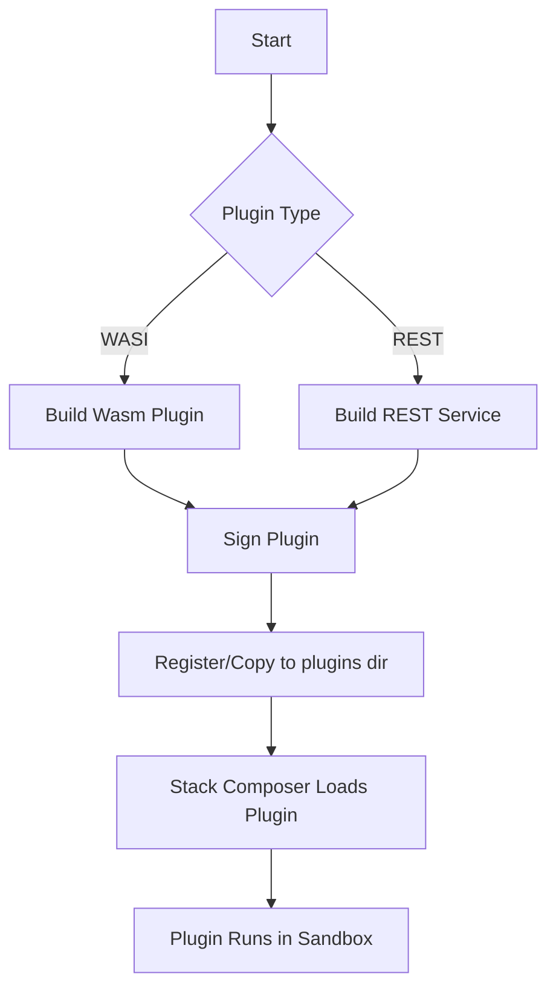

# Plugin SDK

A complete guide for extending **Stack Composer** with first‑class plugins. All examples compile on macOS, Linux and Windows and assume Rust 1.79+, Node 20+ and Wasmtime >= 1.0.

---

## Plugin Types & Lifecycle



---

## 1. Scope

This SDK **covers every officially‑supported integration style**, not just WASI:

| Plugin type          | Typical use                                          | Transport                | Runtime                           |
| -------------------- | ---------------------------------------------------- | ------------------------ | --------------------------------- |
| **WASI (preferred)** | Low‑latency extensions that need direct host calls   | Host → `wasmtime` → Wasm | Rust, Zig, TinyGo, AssemblyScript |
| **REST / gRPC**      | Language‑agnostic micro‑services on localhost or LAN | HTTP 1.1 / HTTP 2        | Any language / container          |
| **Future adapters**  | Experimental host functions, GraphRAG walkers, etc.  | TBD                      | To be defined via ADR             |

The SDK shows how to write, test, sign and distribute each kind, but **WASI is the canonical path** for sandboxed, offline‑first plugins.

---

## 2. Quick Start (WASI Hello World)

```bash
cargo new --lib hello_plugin
cd hello_plugin
# Add Wasmtime & SDK helpers
cargo add wit-bindgen = "0.16" wasmtime = "18"
```

```rust
// src/lib.rs
use exports::stack_composer::plugin::v1::*;
use stack_composer_sdk::host;

struct Plugin;
impl PluginApi for Plugin {
    fn name() -> String { "hello-plugin".into() }
    fn run(input: String) -> Result<String, String> {
        host::log(&format!("received: {input}"));
        Ok(format!("Echo: {input}"))
    }
}
```

```bash
# Build Wasm
cargo wasi build --release
```

Copy the resulting **`hello_plugin.wasm`** and **`hello_plugin.sig`** (see §5) into  
`~/.local/share/stack-composer/plugins/`.

---

## 3. Quick Start (REST Plugin)

```bash
# Example: Node.js REST plugin
mkdir rest_plugin && cd rest_plugin
npm init -y && npm install express
```

```js
// index.js
const express = require('express');
const app = express();
app.use(express.json());
app.post('/run', (req, res) => {
  res.json({ result: `Echo: ${req.body.input}` });
});
app.listen(3000, () => console.log('REST plugin running'));
```

### Register the REST plugin in Stack Composer's config (see docs/configuration.md)

---

## 4. WASI Capability Model

Stack Composer uses Wasmtime's capability model to sandbox plugins:

- **Filesystem**: Plugins are read-only by default; explicit opt-in for write access.
- **Network**: Disabled by default; can be enabled per-plugin in config.
- **Host functions**: Only declared APIs are exposed (e.g., `plugin.search`, `plugin.emit`).

See [WASI Plugin Host](../component-details/plugin-host.md) for host-side details.

---

## 5. Plugin Signing & Verification

- Every `.wasm` bundle must be accompanied by a `.sig` file (Ed25519 signature, hex).
- Verification uses the `ed25519-dalek` crate (2-ms verify on M-series Mac).
- Trusted public keys live in `~/.config/stack-composer/trusted_keys.toml`.
- Plugins without valid signatures are rejected by default.

---

## 6. Testing & Debugging

- Use `wasmtime` CLI to run plugins locally: `wasmtime run hello_plugin.wasm`.
- For REST plugins, use `curl` or Postman to test endpoints.
- Stack Composer logs plugin output to `~/.local/share/stack-composer/logs/`.

---

## 7. Distribution & Registry

- Plugins can be distributed as `.wasm` + `.sig` files or via OCI-based registries (planned).
- No notarisation during v0.x; SHA-256 checksums are published with releases.
- Registry/discovery UI is planned for v1.0.

---

## 8. Security & Compliance

- Plugins are sandboxed (WASI/Wasmtime) and run with least privilege.
- Security thresholds: CVSS ≥ 7.0 blocks plugin install; non-OSI/GPL licenses are blocked.
- All plugins are scanned with `trivy` and `cargo-audit` before release.

---

## 9. Roadmap & Open Questions

- OCI registry integration
- Plugin marketplace and discovery UI
- More host functions (e.g., for GraphRAG, telemetry)
- Support for new plugin languages and runtimes

---

## 10. See Also

- [WASI Plugin Host](../component-details/plugin-host.md)
- [Security Policy](../security-policy.md)
- [Configuration Guide](../configuration.md)
- [Architecture Overview](../architecture-overview.md)

---

_Contributions and feedback are welcome! See [CONTRIBUTING.md](../../CONTRIBUTING.md) for details._
