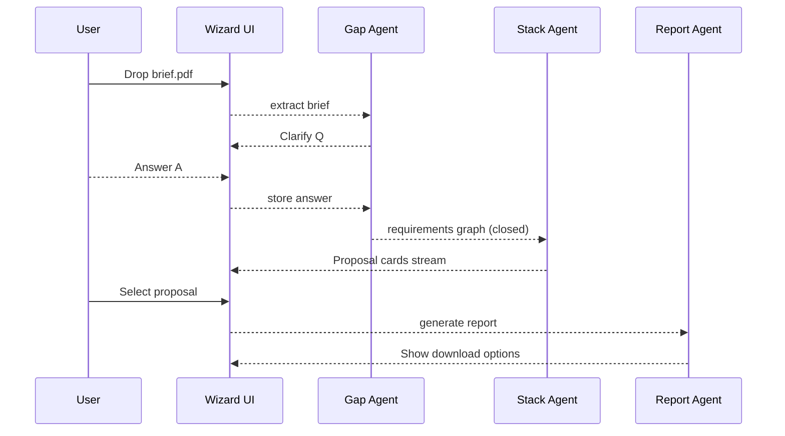

# AI Wizard Roadmap

_The conversational, hybrid‑wizard user experience is central to Stack Composer’s
“tell‑me‑what‑you‑need and I’ll build the stack” promise. This roadmap lays out
the milestones for evolving that wizard from an MVP chat‑form blend (v 0.5) into
a multimodal, collaborative design assistant (v 2.0+). Each feature is pegged
to the sprint cadence defined in_ [`release-engineering/roadmap.md`](../release-engineering/roadmap.md).

---

## 1 Goals & Non‑Goals

| ID           | Goal                           | Measure                                    |
| ------------ | ------------------------------ | ------------------------------------------ |
| W‑01         | Minimise time‑to‑first‑stack   | ≤ 3 minutes from brief drop to proposal    |
| W‑02         | Maintain cognitive flow        | No step forces more than one scroll screen |
| W‑03         | Keyboard‑first accessibility   | Axe score ≥ 90; all controls tabbable      |
| W‑04         | Explainability                 | Every auto‑choice has a “Why?” link        |
| W‑05         | Undo/redo safety net           | Unlimited stack via Decision Timeline      |
| **Non‑goal** | Full graphical low‑code editor | Future idea; wizard stays text+form        |

---

## 2 Feature Timeline by Sprint

| Sprint   | Release     | Wizard Milestones                                            |
| -------- | ----------- | ------------------------------------------------------------ |
| **S‑01** | 0.5‑alpha ¹ | Upload drop‑zone · Chat + form gap‑fill · Basic tree preview |
| **S‑02** | 0.5‑alpha ² | Graph view toggle · Decision Timeline sidebar                |
| **S‑03** | 0.5‑beta    | Conflict‑detection modal · A11y shortcut legend              |
| **S‑04** | 0.5 GA      | Live cost/perf matrix · Inline “Why?” tool‑tips              |
| **S‑05** | 0.8‑alpha   | Signed plugin marketplace pane                               |
| **S‑06** | 0.8‑beta    | RL‑Critic badge + slider to tweak weights                    |
| **S‑07** | 1.0‑RC      | Auto‑update wizard assets, localisation infra (Lingui)       |
| **S‑09** | 1.1         | Marketplace ratings, install‑progress toasts                 |
| **S‑11** | 1.2         | HTN plan Gantt embedded in timeline                          |
| **S‑17** | 2.0‑beta    | Tauri‑Mobile & PWA wizard, Fluid CRDT multi‑cursor           |
| **S‑20** | 2.0 GA      | GraphRAG smart suggestions, voice dictation experiment       |

> **Note:** A sprint is two weeks; “0.5‑alpha ¹” means first half of Sprint 1.

---

## 3 Interaction Flow (v 0.5)

---

## 4 Screen‑by‑Screen Breakdown

| Screen            | Key Elements                           | A11y Notes                              |
| ----------------- | -------------------------------------- | --------------------------------------- |
| **Home**          | Resume banner · “New Project” CTA      | `role="navigation"` landmarks           |
| **Upload**        | Drop‑zone with PDF icon                | Focus outline for drag area             |
| **Clarify**       | Chat area + form slots · skip link     | Form inputs labelled with `<label for>` |
| **Stack Preview** | React Arborist tree · React Flow graph | Tree nodes tabbable; arrow keys expand  |
| **Plan Review**   | Table + Gantt chart                    | Table sortable via `aria-sort`          |
| **Generate**      | Progress spinners · modal export       | `aria-live="polite"` for progress       |

---

## 5 UX Debt Log

- MVP uses colour alone to indicate licence risk → Add icon + text (S‑02).
- Graph view pan‑zoom not yet keyboard accessible.
- Timeline needs scroll restoration after jumping via history.

---

## 6 Technical Debt & Risks

| Risk                                  | Impact                    | Mitigation Sprint                      |
| ------------------------------------- | ------------------------- | -------------------------------------- |
| Wizard state bloat in Redux           | Perf drop on large briefs | S‑03: migrate to Zustand               |
| Tauri window freeze during heavy plan | UX jank                   | S‑04: move plan parse to worker        |
| Multi‑cursor CRDT race                | Data loss                 | S‑18: extensive concurrency test cases |

---

## 7 Metrics & Telemetry

| Metric                    | Target     | Collection Point             |
| ------------------------- | ---------- | ---------------------------- |
| Wizard completion rate    | ≥ 75 %     | `wizard.finish` span         |
| Avg clarify Q’s per brief | ≤ 3        | `wizard.gap_count` histogram |
| Undo use per session      | track only | Decision Timeline events     |
| A11y score (Axe)          | ≥ 90       | CI Lighthouse                |

---

## 8 Open Questions

1. Should conflict modal allow multi‑choice quick‑resolve?
2. How to present “no viable stack” edge case elegantly?
3. Best default weight preset for different project archetypes?

---

## 9 Next Steps (Sprint 1 Backlog)

- [ ] Drop‑zone component with accessible label & drag events
- [ ] Chat + form hybrid component skeleton (`<GapWizard/>`)
- [ ] Decision Timeline store + undo keyboard hooks
- [ ] Axe‑core baseline test in CI

---

## 10 Changelog

| Sprint | Entry                             |
| ------ | --------------------------------- |
| S‑01   | Created initial roadmap document. |
