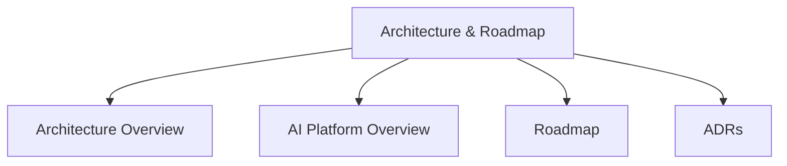

# Architecture & Roadmap

Understand the design, platform architecture, and future direction of Stack Composer.

## Section Structure

## Key Guides

- [Architecture Overview](../architecture-overview.md): High-level system design.
- [AI Platform Overview](../ai-platform-overview.md): AI subsystem details.
- [Roadmap](../roadmap.md): Planned features and milestones.
- [ADRs](../adr/0000-template.md): Architectural decision records.
- [Context](context.md)
- [Containers](containers.md)
- [Components](components.md)
- [Data Flow](data-flow.md)
- [Extensibility](extensibility.md)

---

**Next Steps:**

- Review [Operations & Security](../ops-guide.md) for deployment and security.
- Explore [Extensibility](../plugin-sdk/README.md) for customization.
