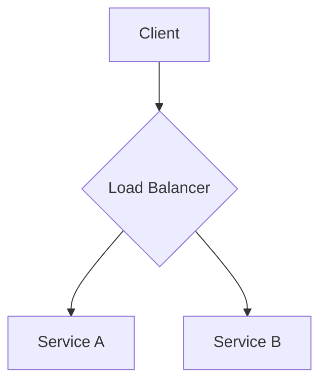

# Architecture Overview

This document provides a high-level overview of the Stack Composer architecture.

## System Diagram

*This is a placeholder diagram. We will use Mermaid to create a more detailed diagram of the system architecture.*

## Subsystems

...
