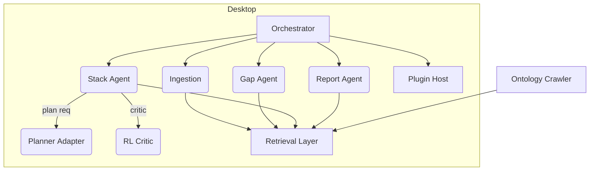
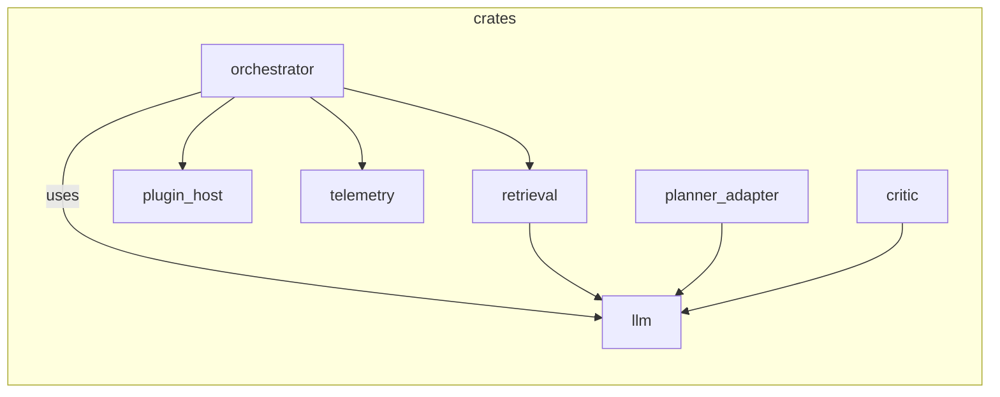

# Component Details

This page is a placeholder for component details documentation. Add summaries and links to each component's documentation here.

# Component Details Index

Every high‑level module inside **Stack Composer** is mapped here.  
The table gives you a “where‑is‑what” view, while the Mermaid diagrams show how
those pieces talk to each other at runtime.

---

## 1 Component Matrix

| #   | Component              | Doc                                                      | Lead Dir / Crate         | Status            |
| --- | ---------------------- | -------------------------------------------------------- | ------------------------ | ----------------- |
| 1   | **Rust Orchestrator**  | [orchestrator.md](../components/orchestrator.md)         | `crates/orchestrator`    | **In Progress**   |
| 2   | **LLM Runtime**        | [llm-runtime.md](../components/llm-runtime.md)           | `crates/llm`             | Draft             |
| 3   | **Retrieval Layer**    | [retrieval-layer.md](../components/retrieval-layer.md)   | `crates/retrieval`       | Draft             |
| 4   | **Ingestion Agent**    | [ingestion-agent.md](../components/ingestion-agent.md)   | `agents/ingestion`       | Draft             |
| 5   | **Gap‑Analysis Agent** | [gap-agent.md](../components/gap-agent.md)               | `agents/gap`             | Draft             |
| 6   | **Stack Agent**        | [stack-agent.md](../components/stack-agent.md)           | `agents/stack`           | Draft             |
| 7   | **Report Agent**       | [report-agent.md](../components/report-agent.md)         | `agents/report`          | Draft             |
| 8   | **Planner Adapter**    | [planner-adapter.md](../components/planner-adapter.md)   | `crates/planner-adapter` | **Spec Complete** |
| 9   | **RL Critic**          | [rl-critic.md](../ai-sub-system-docs/rl-critic.md)       | `crates/critic`          | **Spec Complete** |
| 10  | **WASI Plugin Host**   | [plugin-host.md](../components/plugin-host.md)           | `crates/plugin-host`     | Draft             |
| 11  | **Ontology Crawler**   | [ontology-crawler.md](../components/ontology-crawler.md) | `tasks/crawler`          | Draft             |
| 12  | **Telemetry Pipeline** | [telemetry.md](../components/telemetry.md)               | `crates/telemetry`       | Draft             |

> **Workflow hint:** update this table & status column in the same PR that
> changes the matching code. Our CI linter fails if a referenced doc is
> missing.

---

## 2 Runtime Interaction Diagram

---

## 3 Build‑time crate relationships

---

## 4 Status Legend

| Icon               | Meaning                                |
| ------------------ | -------------------------------------- |
| **Draft**          | Skeleton doc exists; API may shift.    |
| **In Progress**    | Active implementation.                 |
| **Spec Complete**  | Design frozen; impl PR pending.        |
| **🚀 Implemented** | Code merged, tests pass, docs current. |

---

### How to add a new component

1. Create code under `crates/` or `agents/`.
2. Add a `<name>.md` doc in this folder and link it in the table.
3. Update the diagrams if the new component has runtime links.
4. Open a PR; CI will render Mermaid and check for broken anchors.

Happy architecting! 🏗️
