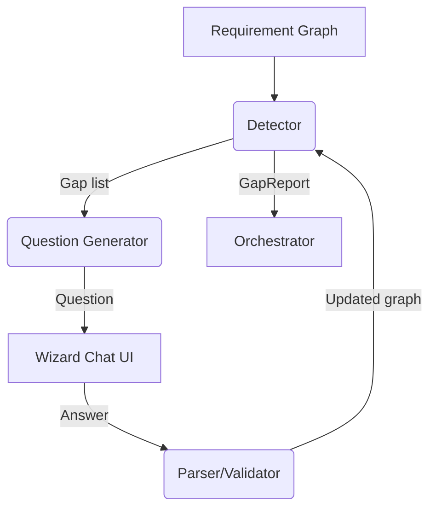

# Gap‑Analysis Agent

_Status: Draft — last updated 2025‑06‑20_
The **Gap‑Analysis Agent** (GAA) is Stack Composer’s “requirements auditor”.
It inspects the structured requirement graph emitted by the Ingestion Agent,
identifies underspecified or conflicting areas, and drives an
LLM‑assisted dialog to close those gaps before planning starts.

---

## 1 Responsibilities

| #   | Responsibility                    | Notes                                 |
| --- | --------------------------------- | ------------------------------------- |
| 1   | **Detect missing constraints**    | map extracted → ontology slots        |
| 2   | **Generate clarifying questions** | natural‑language via LLM prompt       |
| 3   | **Track user answers**            | write‐back to requirements graph      |
| 4   | **Re‑validate** after each answer | stop when confidence ≥ 0.85           |
| 5   | **Emit GapReport** for UI         | includes severity, suggested defaults |

---

## 2 Data Flow



---

## 3 Public API (surface)

```rust
pub struct Gap {
    pub id: Uuid,
    pub slot: String,
    pub description: String,
    pub severity: GapSeverity, // Missing | Ambiguous | Conflict
}

pub struct Question {
    pub gap_id: Uuid,
    pub text: String,
    pub suggested_answers: Vec<String>,
}

pub trait GapAgent {
    async fn find_gaps(req_graph: &RequirementGraph) -> Vec<Gap>;
    async fn ask_question(gap: &Gap) -> Question;
    async fn consume_answer(gap_id: Uuid, answer: String) -> anyhow::Result<()>;
}
```

---

## 4 Gap‑Detection Heuristics (v0 .5)

| Heuristic              | Example                                         |
| ---------------------- | ----------------------------------------------- |
| **Licence mismatch**   | GPL framework + permissive-only flag            |
| **Deployment target**  | Mobile app brief lacks target OS                |
| **Perf budget absent** | Real‑time requirement missing latency number    |
| **Ambiguous scale**    | “support lots of users” → ask for numeric range |

Rules live in `agents/gap/src/heuristics.rs`.

---

## 5 LLM Prompt (system)

> “You are an experienced software architect. Given the following missing or ambiguous requirement slot, write **one** clarifying question that is concise, unambiguous, and avoids tech‑jargon.”

---

## 6 UI/UX Details

- Questions appear in the wizard chat with a **purple “Needs Info” badge**.
- User may **skip** a question; severity downgraded to _warning_, planner will choose default.
- Decision Timeline records each answer; hover shows previous state.
- Accessibility: first suggested answer is focussed; arrow keys cycle; <kbd>Space</kbd> selects.

---

## 7 Extension Hooks

| Hook                       | How                                                              |
| -------------------------- | ---------------------------------------------------------------- |
| **Custom heuristics**      | WASI plugin implements `fn detect(req_graph) -> Vec<Gap>`        |
| **Ontology sources**       | Provide additional `*.toml` mapping loaded at runtime            |
| **GraphRAG gap reasoning** | v2 plugin can override `find_gaps` to call property‑graph search |

---

## 8 Roadmap

| Version | Enhancement                             |
| ------- | --------------------------------------- |
| 0.8     | Ontology versioning; diff per project   |
| 1.0     | SHACL constraints, auto‑fix suggestions |
| 2.0     | GraphRAG‑powered gap inference          |

---

## 9 Open Questions

- Optimal UI for bulk answering multiple low‑severity gaps?
- Should skipped gaps be revisited post‑planner to refine defaults?

---

## 10 Usage Snippet

```rust
let gaps = gap_agent.find_gaps(&req_graph).await?;
for gap in gaps {
    let q = gap_agent.ask_question(&gap).await?;
    ui.show_question(q);
}
```

---

See also:

- [Ingestion Agent](ingestion-agent.md)
- [Stack Agent](stack-agent.md)
- [Planner Integration](../ai-sub-system-docs/planner-integration.md)
