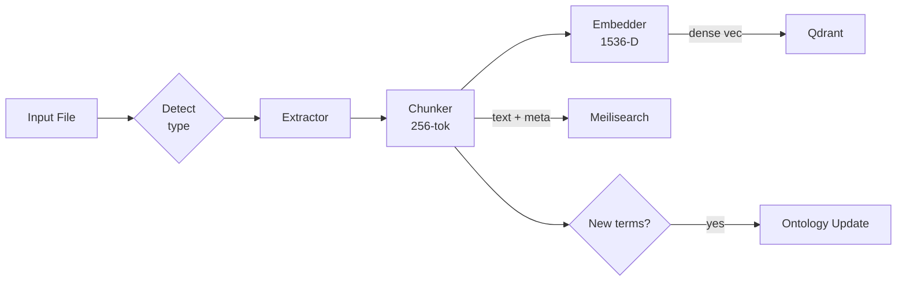

# Ingestion Agent

_Status: Draft — last updated 2025‑06‑20_
The **Ingestion Agent** is the first link in the Stack Composer pipeline. It
converts human‑authored project briefs into machine‑actionable chunks ready for
hybrid retrieval and downstream reasoning.

---

## 1 Responsibilities

| #   | Task                    | Detail                                                     |
| --- | ----------------------- | ---------------------------------------------------------- |
| 1   | **File‑type detection** | MIME sniff & magic‑byte inspection.                        |
| 2   | **Text extraction**     | PDF, DOCX, Markdown, plaintext; OCR fallback (v 1.1).      |
| 3   | **Chunking**            | Sliding 256‑token windows (64‑token overlap).              |
| 4   | **Embedding**           | Ollama embeddings endpoint; local fastText fallback.       |
| 5   | **Persistence**         | Write chunks into Qdrant & Meilisearch in one transaction. |
| 6   | **Ontology enrichment** | Detect new terms → emit `OntologyUpdate` event.            |

---

## 2 Data Flow



---

## 3 Extractor Matrix

| Type        | Extractor crate             | Notes                          |
| ----------- | --------------------------- | ------------------------------ |
| PDF         | `pdf_extract`               | Text‑only; images discarded.   |
| DOCX        | `mammoth-rs`                | Preserves headings, lists.     |
| Markdown    | `pulldown-cmark`            | Strips code‑fences by default. |
| TXT         | native `std::fs` read       | UTF‑8 assumed; BOM handled.    |
| Unsupported | `tesseract` via CLI (v 1.1) | OCR fallback.                  |

---

## 4 Chunking Strategy

- **Window = 256 tokens**; **Overlap = 64 tokens** to maximise context reuse.
- Implemented in `agents/ingestion/src/chunker.rs`:

```rust
pub fn chunk(tokens: &[u32]) -> Vec<Chunk> {
    tokens
      .chunks(WINDOW)
      .scan(0, |offset, slice| {
          let idx = *offset;
          *offset += WINDOW - OVERLAP;
          Some(Chunk { idx, tokens: slice.to_vec() })
      })
      .collect()
}
```

---

## 5 Public API

```rust
pub struct IngestResult {
    pub chunk_ids: Vec<Uuid>,
    pub meta: DocMeta,
}

#[async_trait]
pub trait IngestionAgent {
    async fn ingest(path: PathBuf) -> anyhow::Result<IngestResult>;
    async fn shutdown() -> anyhow::Result<()>;
}
```

### CLI Usage

```bash
stack-composer ingest brief.pdf --json
```

---

## 6 Extension Hooks

| Hook                        | How to implement                                   |
| --------------------------- | -------------------------------------------------- |
| **New file format**         | WASI plugin exports `fn extract(bytes) -> String`. |
| **Custom chunker**          | Register `Box<dyn Chunker>` via plugin manifest.   |
| **Pre‑processing pipeline** | Add `preprocess.rs` in plugin; receives raw text.  |

---

## 7 Configuration (`ingestion.toml`)

```toml
[chunking]
window_tokens  = 256
overlap_tokens = 64

[embedding]
provider  = "ollama"
model     = "phi3-embedding"
timeout_ms = 5000
```

---

## 8 Roadmap

| Version | Feature                                      |
| ------- | -------------------------------------------- |
| 0.5     | Core extract‑chunk‑embed‑persist (this spec) |
| 0.8     | Parallel ingestion jobs; progress bar UI     |
| 1.0     | OCR fallback (tesseract)                     |
| 1.2     | Clustered ingestion (gRPC)                   |
| 2.0     | Incremental re‑ingest & delta detection      |

---

## 9 Open Questions

- Should the extractor preserve images for future multimodal models?
- Strategy for deduping near‑identical chunks across multiple briefs?

---

## 10 Usage Example

```rust
let res = ingestion_agent.ingest(PathBuf::from("spec.docx")).await?;
println!("{} chunks stored", res.chunk_ids.len());
```

---

See also:

- [Retrieval Layer](retrieval-layer.md)
- [Gap‑Analysis Agent](gap-agent.md)
- [RAG Design](../ai-sub-system-docs/rag-design.md)
