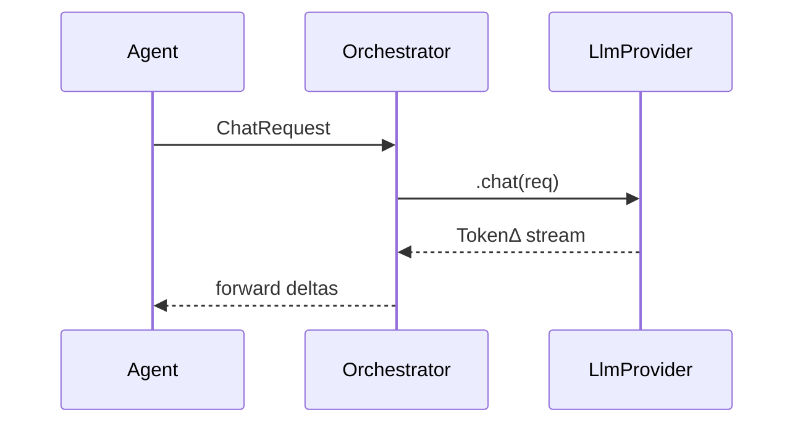

# LLM Runtime Abstraction

_Status · Spec Complete — last updated 2025‑06‑20_
The **LLM Runtime** decouples Stack Composer’s agents from any specific
large‑language‑model back‑end. It hides networking, model hot‑swap, streaming,
and error‑handling behind a single trait so you can swap Ollama for vLLM, LM Studio, or Hugging Face TGI without touching business logic.

---

## 1 Responsibilities

| #   | Responsibility              | Notes                                                    |
| --- | --------------------------- | -------------------------------------------------------- |
| 1   | **Provider abstraction**    | Ollama (default), vLLM, LM Studio, HF TGI                |
| 2   | **Model lifecycle**         | pull → check hash → load → unload                        |
| 3   | **Streaming inference**     | Tokio async stream of token deltas                       |
| 4   | **Back‑pressure & retries** | Rate‑limit queue; exponential back‑off                   |
| 5   | **Auth & proxy**            | OpenAI‑style `Authorization` header; HTTPS proxy support |
| 6   | **Telemetry hooks**         | Emit OpenTelemetry spans: `llm.request`, `llm.token`     |

---

## 2 Public Trait

```rust
#[async_trait]
pub trait LlmProvider: Send + Sync {
    /// Streamed chat completion.
    async fn chat(
        &self,
        req: ChatRequest,
    ) -> anyhow::Result<Pin<Box<dyn Stream<Item = TokenDelta> + Send>>>;

    /// Embedding endpoint (optional; falls back to fastText).
    async fn embed(&self, input: &str) -> anyhow::Result<Vec<f32>>;

    /// List local and remote models with meta.
    async fn models(&self) -> anyhow::Result<Vec<ModelInfo>>;
}
```

Default provider = **`OllamaProvider`** (file: `providers/ollama.rs`).

---

## 3 Provider Matrix

| Provider      | Transport  | Streaming | Embeddings              | Notes                       |
| ------------- | ---------- | --------- | ----------------------- | --------------------------- |
| **Ollama**    | REST 11434 | ✔ SSE    | ✔                      | Bundled installer script    |
| **vLLM**      | HTTP 8000  | ✔ (SSE)  | ✔                      | Requires CUDA; opt‑in       |
| **LM Studio** | HTTP 1234  | ✔ SSE    | ✖ — uses text endpoint | Desktop GUI must be running |
| **HF TGI**    | HTTP 8080  | ✔ SSE    | ✔                      | GPU heavy; cloud or Docker  |

---

## 4 Runtime Flow



Failures propagate as `LlmError::{Timeout, ProviderDown, ModelNotFound}`.

---

## 5 Configuration (`llm.toml`)

```toml
[defaults]
provider = "ollama"
model    = "phi3:4b-instruct"

[ollama]
endpoint = "http://localhost:11434"
timeout_ms = 80000

[vllm]
endpoint = "http://localhost:8000"
max_input_tokens = 8192
```

CLI overrides: `--llm provider=vllm model=phi3:8b`.

---

## 6 Security & Sandbox

- HTTPS proxy honoured via `HTTPS_PROXY` env.
- Request/response JSON logged only when `SC_DEBUG=llm`.
- Tokens never stored; only usage stats emit to Telemetry.

---

## 7 Benchmarks

| Provider      | Model         | p50 latency (256 tok) | RAM (RSS) |
| ------------- | ------------- | --------------------- | --------- |
| Ollama        | phi‑3 4b      | 0.9 s                 | 2 GB      |
| vLLM CUDA A10 | phi‑3 8b      | 0.12 s                | 5 GB GPU  |
| LM Studio CPU | mistral‑7b Q4 | 1.5 s                 | 6 GB      |
| HF TGI GPU    | llama‑3 8b    | 0.11 s                | 7 GB GPU  |

Bench script: `benches/llm_bench.rs`.

---

## 8 Extension Hooks

| Hook                | How                                                             |
| ------------------- | --------------------------------------------------------------- |
| **New provider**    | Implement `LlmProvider`; register with `ProviderRegistry::add`. |
| **Prompt template** | WASI plugin can override `system` & `suffix`.                   |
| **Token filters**   | Provide closure in `Settings ▸ Advanced ▸ Token Hook`.          |

---

## 9 Roadmap

| Version | Feature                           |
| ------- | --------------------------------- |
| 0.5     | Ollama provider + model auto‑pull |
| 0.8     | vLLM & HF TGI adapters            |
| 1.0     | Hot‑swap without losing context   |
| 1.1     | Multi‑model routing by agent role |
| 2.0     | On‑device LoRA fine‑tune API      |

---

##  10 FAQ

**What happens if no provider is running?**
Model probe (see Usage § 7) prompts install or remote API key.

**Does the runtime cache embeddings?**
Yes, SQLite BLOB cache keyed by SHA‑256 of input.

**How are prompts escaped?**
`serde_json::to_string` wraps user content to guard against prompt‑injection.

---

See also:

- [Retrieval Layer](retrieval-layer.md)
- [Planner Integration](../ai-sub-system-docs/planner-integration.md)
- [Plugin SDK](../plugin-sdk/README.md)
