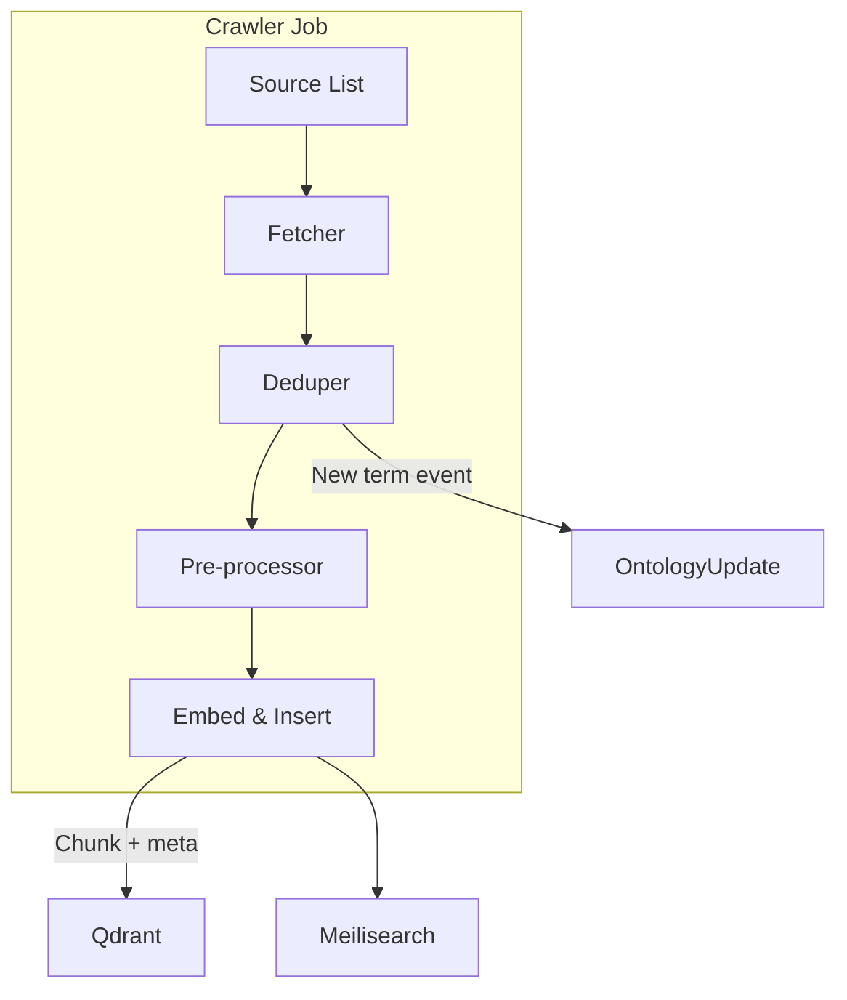

# Weekly Ontology Crawler

## Responsibilities

- Refresh and update the knowledge base/ontology
- Schedule and run periodic crawls
- Integrate new data into the system

## Public APIs

- `run_crawl() -> Result`
- `update_schedule(cron: str)`

## Extension Hooks

- Support for new data sources
- Custom scheduling logic

## Roadmap & Enhancements

- Ontology versioning and updates
- Validation workflow (UI/CLI) for vetting updates
- Distributed updates for multi-node/clustered refresh

## Open Questions

- How to handle failed or partial crawls?
- What is the best way to notify users of updates?

## How to Extend/Customize

- Add new data source connectors via plugin
- Implement custom crawl strategies

## Real-World Usage Example

```rust
weekly_crawler.run_crawl();
```

---

See [Architecture Questions](../architecture/architecture-questions.md) for open questions and strategic direction.

_See also: [Ontology/Knowledge Graph](../Architecture%20&%20Component%20Guides/architecture-questions.md)_

# Weekly Ontology Crawler

_Status: Draft — last updated 2025‑06‑20_
The **Ontology Crawler** (OC) keeps Stack Composer’s knowledge base fresh by
ingesting release notes, security advisories, and package‑registry metadata into
the hybrid RAG store each week. It runs as a scheduled background task, fully
offline‑capable and sand‑boxed.

---

## 1 Responsibilities

| #   | Task                        | Detail                                                        |
| --- | --------------------------- | ------------------------------------------------------------- |
| 1   | **Schedule periodic jobs**  | Default cron `0 3 * * 0` (Sun 03:00 local).                   |
| 2   | **Fetch data sources**      | GitHub release RSS, NVD CVE JSON feeds, crates.io / npm REST. |
| 3   | **Deduplicate & diff**      | SHA‑256 hashes; only new artefacts embedded.                  |
| 4   | **Embed & persist**         | Use LLM embedder ➜ Qdrant + Meilisearch hybrid store.         |
| 5   | **Licence tagging**         | Parse SPDX id; block non‑OSI licences pre‑insert.             |
| 6   | **Emit telemetry & events** | `oc.crawl.start`, `oc.crawl.success/fail`.                    |

---

## 2 Architecture & Data Flow



- **Fetcher** supports HTTP(S), RSS/Atom, gzip JSON.
- **Pre‑processor** strips HTML, YAML front‑matter, Markdown code fences.

---

## 3 Source Configuration (`crawler.toml`)

```toml
[schedule]
cron = "0 3 * * 0"

[sources]
github_rss = [
  "https://github.com/rust-lang/rust/releases.atom",
  "https://github.com/facebook/react/releases.atom"
]
nvd_cve_json = "https://nvd.nist.gov/feeds/json/cve/1.1/nvdcve-1.1-recent.json.gz"
npm_api      = "https://registry.npmjs.org/-/v1/search?text=keywords:framework"
crates_api   = "https://crates.io/api/v1/crates?page=1&per_page=100"
```

Add/remove sources via Settings ▸ Ontology ▸ Data Sources.

---

## 4 Public API

```rust
pub struct CrawlStats {
    pub docs_inserted: u32,
    pub duplicates_skipped: u32,
    pub duration_ms: u128,
}

#[async_trait]
pub trait OntologyCrawler {
    async fn run_crawl(manual: bool) -> anyhow::Result<CrawlStats>;
    async fn update_schedule(cron: &str) -> anyhow::Result<()>;
}
```

Manual flag bypasses cron; useful in CI or test.

---

## 5 Scheduler Implementation

- Uses `tokio-cron-scheduler`.
- Misfire policy: run immediately if last missed by >24 h.
- Jobs run in a separate Tokio runtime with `ulimit -n 512`.

---

## 6 Security & Sandboxing

| Concern            | Mitigation                                                   |
| ------------------ | ------------------------------------------------------------ |
| Malicious JSON/rss | `serde_json` & `quick-xml` with size cap 5 MB/file.          |
| Network exposure   | Proxy honoured via `HTTPS_PROXY`; offline mode denies fetch. |
| Licences           | Non‑OSI ids are dropped before persistence.                  |
| Secrets            | Values like `ghp_` tokens redacted via regex.                |

---

## 7 Extension Hooks

| Hook                   | How                                                   |
| ---------------------- | ----------------------------------------------------- |
| **New source plugin**  | WASI plugin exports `fn fetch() -> Vec<Artifact>`.    |
| **Custom scheduler**   | Replace `tokio-cron` with plugin’s `next_run()` impl. |
| **Transform pipeline** | Insert middleware via plugin manifest ordering.       |

---

## 8 Monitoring & Telemetry

- OpenTelemetry spans: `oc.fetch`, `oc.embed`, `oc.insert`.
- Logs in `~/.local/share/stack-composer/logs/oc-*.log`.
- Dashboard card shows last run, docs added, next run countdown.

---

## 9 Roadmap

| Version | Feature                                             |
| ------- | --------------------------------------------------- |
| 0.5     | Single‑threaded weekly crawl (this spec)            |
| 0.8     | Incremental updates + OCI plugin registry ingestion |
| 1.0     | Distributed crawl across LAN (gRPC)                 |
| 1.1     | Signed artefact verification (in‑toto)              |
| 2.0     | Graph diff visualiser & rollback UI                 |

---

## 10 FAQ

**What if a crawl fails mid‑way?**
Partial inserts are rolled back via SQLite WAL transaction; last success time
remains unchanged.

**Can I run the crawler head‑less?**
Yes: `stack-composer crawl --once --json`.

**How to add a private source that needs auth?**
Set `SC_CRAWLER_TOKEN_<ID>` env variable and reference `<ID>` in `crawler.toml`
source URL.

---

See also:

- [RAG Design](../ai-sub-system-docs/rag-design.md)
- [Ingestion Agent](ingestion-agent.md)
- [Telemetry Pipeline](telemetry.md)
