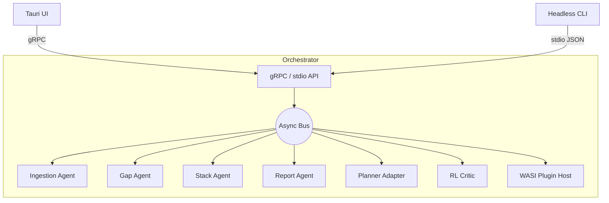

> _Status: In Progress – last updated 2025‑06‑20_

# Rust Orchestrator

The **Orchestrator** is the beating heart of Stack Composer.  
It spawns, supervises and connects every agent and long‑running service, while
presenting a single, language‑agnostic IPC surface to the UI, CLI, and any
automation clients.

---

## 1 Responsibilities

| #   | Responsibility                               | Implementation Notes                                                 |
| --- | -------------------------------------------- | -------------------------------------------------------------------- |
| 1   | **Lifecycle** – start/stop agents & services | Tokio work‑stealing runtime; dynamic supervisor tree                 |
| 2   | **Routing** – async message bus              | `tokio::mpsc` channels keyed by `AgentId`                            |
| 3   | **Plugin hand‑off**                          | Attach WASI capability tokens; forward host calls                    |
| 4   | **IPC façade**                               | gRPC bidirectional stream for Tauri UI; JSON over stdio for headless |
| 5   | **Health & metrics**                         | `/healthz` HTTP endpoint; OpenTelemetry spans                        |
| 6   | **Config hot‑reload**                        | Watch `*.toml`; diff → live update without restart                   |
| 7   | **Graceful shutdown**                        | Fan‑out `Shutdown` message, await tasks, flush WALs                  |

---

## 2 High‑level Architecture



_Every arrow = non‑blocking channel; buffer size defaults to `512`._

---

## 3 Key APIs

### 3.1 Agent Registry

```rust
type AgentId = String;

pub trait AgentHandle: Send + Sync {
    fn id(&self) -> &AgentId;
    async fn send(&self, msg: AgentMsg) -> anyhow::Result<()>;
}

pub struct Orchestrator {
    registry: DashMap<AgentId, Box<dyn AgentHandle>>,
}
```

### 3.2 Public IPC (gRPC)

\* `orchestrator.proto` owns two bidirectional streams:

```protobuf
service Orchestrator {
  rpc Command(stream CommandReq) returns (stream CommandRes);
  rpc Events(Empty) returns (stream Event);
}
```

\* Commands mutate state; Events are broadcast (e.g., “PlannerDone”).

---

## 4 Configuration (`orchestrator.toml`)

```toml
[general]
max_concurrent_agents = 12
shutdown_timeout_secs = 15

[ipc]
grpc_port = 5123
stdio_json = true

[logging]
level = "info"           # trace|debug|info|warn|error
file  = "~/.local/share/stack-composer/logs/orch.log"
```

Reload on file‑change via `notify` crate; fields that can’t reload (e.g.,
`grpc_port`) trigger “restart‑needed” event.

---

## 5 Extension Hooks

| Hook               | Description                                                               |
| ------------------ | ------------------------------------------------------------------------- |
| **`PluginInit`**   | WASI plugin registers new host fns; orchestrator adds to capability table |
| **`AgentFactory`** | Tests or plugins can inject mock agents at runtime                        |
| **`Middleware`**   | Intercept `AgentMsg` (e.g., for tracing or throttling)                    |

---

## 6 Security Considerations

*All plugin calls execute in Wasmtime sandbox; orchestrator binds only allowed
host functions.  
* gRPC port listens on `127.0.0.1` by default; set `--grpc-bind 0.0.0.0` to
expose.  
_ Sensitive config values (tokens) loaded from `$SC*SECRET*_` env vars.

---

## 7 Metrics & Observability

*OpenTelemetry spans: `orch.agent.spawn`, `orch.msg.send`, `orch.shutdown`.  
* Prometheus exporter (`/metrics` on port `9134`) summarises per‑agent mailbox
depth and task count.  
\* `orch doctor` CLI prints live status table.

---

## 8 Roadmap & Enhancements

| Version | Planned Feature                                           |
| ------- | --------------------------------------------------------- |
| 0.5     | Core async bus, gRPC façade, health endpoint              |
| 0.8     | Hot‑reload config, dynamic plugin host attach             |
| 1.0     | Cluster mode: orchestrator ⇄ orchestrator gRPC federation |
| 1.1     | REST proxy & WebSocket events for web clients             |
| 2.0     | Kubernetes operator for multi‑node orchestration          |

---

## 9 Implementation Guide

1. Entry point `crates/orchestrator/src/main.rs` builds `Builder` then `run()`.  
2. Unit tests (`tests/`) pause tokio clock → deterministic timeouts.  
3. Benchmarks (`benches/`) use `criterion` to measure 10 k msg/s throughput.  
4. Use `just orch-dev` to start orchestrator standalone with hot‑reload.

---

## 10 FAQ

**How do I add a new agent?**  
Implement `AgentHandle`, register via `orchestrator.add_agent()` at start‑up.

**Can I embed orchestrator in another process?**  
Yes—link `orchestrator` crate, call `Builder::default().run_embedded()`.

**What happens on panic inside an agent?**  
Supervisor restarts task up to 3 times, then marks agent unhealthy and emits
`AgentCrashed` event.

---

See also:  
*[Gap‑Analysis Agent](gap-agent.md)  
* [Planner Integration](../ai-sub-system-docs/planner-integration.md)
