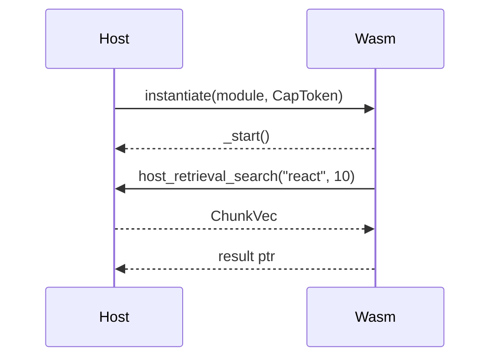

> _Status: Draft — last updated 2025‑06‑20_

# WASI Plugin Host

## Responsibilities

- Host and manage WASI plugins
- Enforce capability tokens and sandboxing
- Provide host functions for plugin interaction
- Verify plugin signatures (Ed25519)
- Enforce per-plugin permissions (filesystem/network)

## Public APIs

- `load_plugin(path: str)`
- `call_plugin(func: str, args: List)`

## Extension Hooks

- Support for new plugin types (REST, gRPC, future adapters)
- Custom host functions

## Roadmap & Enhancements

- OCI-based plugin registry
- In-app plugin discovery UI
- Security templates & SDKs for plugin authoring
- Sample plugins with docs and best practices
- Registry/discovery UI for plugin management

## Open Questions

- How to manage plugin permissions securely?
- What is the best way to version plugins?
- How to support new plugin transports (GraphRAG, telemetry)?

## How to Extend/Customize

- Add new host functions via the plugin API
- Register new plugin types in the registry
- Configure plugin permissions in the config file

## Real-World Usage Example

```rust
plugin_host.load_plugin("my_plugin.wasm");
```

---

- Plugins are auto-discovered from `~/.local/share/stack-composer/plugins/`.
- Only plugins with valid Ed25519 signatures are loaded (see [Plugin SDK](../plugin-sdk/README.md)).
- Per-plugin permissions (filesystem/network) are enforced as configured (see [Configuration Guide](../configuration.md)).

See [architecture-questions.md](../architecture/architecture-questions.md) for open questions and strategic direction.

_See also: [LLM Runtime](llm-runtime.md), [Telemetry Pipeline](telemetry.md)_

---

The **Plugin Host** lets Stack Composer load, execute and sandbox untrusted
extensions compiled to WebAssembly System Interface (**WASI**). It provides an
API surface that mirrors native host functions (retrieval, LLM, planner, log,
network) while enforcing capability‑based security and signature verification.

---

## 1 Responsibilities

| #   | Task                                   | Implementation                                                              |
| --- | -------------------------------------- | --------------------------------------------------------------------------- |
| 1   | Discover plugins in user + system dirs | `~/.local/share/stack-composer/plugins/` and `/opt/stack-composer/plugins/` |
| 2   | Verify **Ed25519** signatures          | `ed25519-dalek` crate; trust store in `trusted_keys.toml`                   |
| 3   | Instantiate Wasm via **Wasmtime**      | WasiCtx builder restricts FS & net according to capability token            |
| 4   | Expose host functions                  | `retrieval_search`, `llm_chat`, `plan_solve`, `log`, `network_fetch*`       |
| 5   | Enforce per‑plugin runtime limits      | Fuel metering (10 M ops), 256 MiB mem cap, 5 s wall‑time                    |
| 6   | Hot‑reload on file change              | Notify watcher ⇒ unload → verify → reload                                   |
| 7   | Telemetry & audit                      | Emit `plugin.load`, `plugin.call`, `plugin.panic` OTLP spans                |

---

## 2 Directory Layout & Discovery

```text
plugins/
├─ hello-plugin.wasm
├─ hello-plugin.sig
├─ hello-plugin.toml
└─ readme.md
```

- `.wasm` – compiled WASI module
- `.sig` – Ed25519 signature file (hex)
- `.toml` – manifest (see § 3)
- Extra docs are ignored at runtime but shown in Marketplace UI.

---

## 3 Plugin Manifest Schema (`plugin.toml`)

```toml
[plugin]
id          = "org.example.hello"
version     = "0.1.0"
wasm_target = "wasm32-wasi"
signature   = "file:hello-plugin.sig"
capabilities = ["log", "retrieval"]
entry       = "_start"

[meta]
name        = "Hello Plugin"
description = "Echo back the user input."
license     = "MIT"
authors     = ["Jane Dev <jane@example.org>"]
```

---

## 4 Capability Model

| Capability  | Host Function(s)                               | Notes                        |
| ----------- | ---------------------------------------------- | ---------------------------- |
| `log`       | `host_log(level: i32, ptr: *, len: usize)`     | Always enabled               |
| `retrieval` | `host_retrieval_search(q_ptr, q_len, k)`       | RAG chunks returned          |
| `llm`       | `host_llm_chat(req_ptr, len)`                  | Stream tokens                |
| `plan`      | `host_plan(domain_ptr, prob_ptr)`              | Planner JSON                 |
| `network`   | `host_fetch(url_ptr, len, body_ptr, body_len)` | Disabled offline             |
| `fs_read`   | WASI `path_open` read‑only                     | Sandboxed dir `/plugin/data` |

Plugins request caps in manifest; orchestrator grants or denies. Denied caps
result in trap on call.

---

## 5 Runtime Flow



Fuel metering decrements per Wasm op; exhaustion traps with
`PluginError::FuelExhausted`.

---

## 6 Security & Sandboxing

- **Wasmtime 18** with `Config::new().consume_fuel(true)`
- Memory cap 256 MiB (`StoreLimiterAsync`).
- No `fd_write` unless `log` cap is granted.
- `network` cap subject to proxy & offline mode.
- SHA‑256 hash of `.wasm` and `.sig` logged for SBOM.

---

## 7 Public Host APIs (WIT ≥ v1)

```wit
package stack-composer:plugin;

interface host {
  log: func(level: s32, msg: string);
  retrieval-search: func(query: string, k: u32) -> list<chunk>;
  llm-chat: func(request: chat-request) -> stream<token-delta>;
  plan-solve: func(domain: string, problem: string) -> list<plan-step>;
  network-fetch: func(url: string, body: option<string>) -> string;
}
```

Generated bindings via `wit-bindgen` for Rust, TinyGo, Zig, JS.

---

## 8 Configuration (`plugin-host.toml`)

```toml
[limits]
fuel_units   = 10000000
mem_bytes    = 268435456
wall_timeout_ms = 5000

[paths]
user_dir  = "~/.local/share/stack-composer/plugins"
system_dir = "/opt/stack-composer/plugins"
```

---

## 9 Marketplace Workflow

| Phase       | Detail                                    | Version |
| ----------- | ----------------------------------------- | ------- |
| Discovery   | Scan directories, parse manifests         | 0.5     |
| Rating      | User can star/rate; data stored locally   | 0.8     |
| Registry    | OCI registry backend (`crates/registry`)  | 0.8     |
| Auto‑update | Check new version → verify sig → hot‑swap | 1.1     |

---

## 10 Testing

- Unit tests use `wasmtime::Module::new(&engine, wasm_bytes)` fixtures.
- Integration tests load sample plugin and assert host func round‑trips.
- Fuzzing (`cargo fuzz`) targets signature parser & capability deserializer.

---

## 11 Open Questions

1. Support WASI‑NN interface for on‑device model inference?
2. Version negotiation for host functions beyond v1?
3. Should plugin logs pipe to centralized UI pane?

---

## 12 Usage Snippet

```rust
let ph = PluginHost::default();
ph.load_plugin("/path/to/hello-plugin.wasm").await?;
let res = ph.call_plugin("run", &["hello"]).await?;
println!("Plugin said: {}", res);
```

---

## See Also

- [Plugin Example](plugin-example.md): Concrete WASI plugin/extension example for Stack Composer extensibility.

See also:

- [Plugin SDK](../plugin-sdk/README.md)
- [LLM Runtime](llm-runtime.md)
- [Telemetry Pipeline](telemetry.md)
