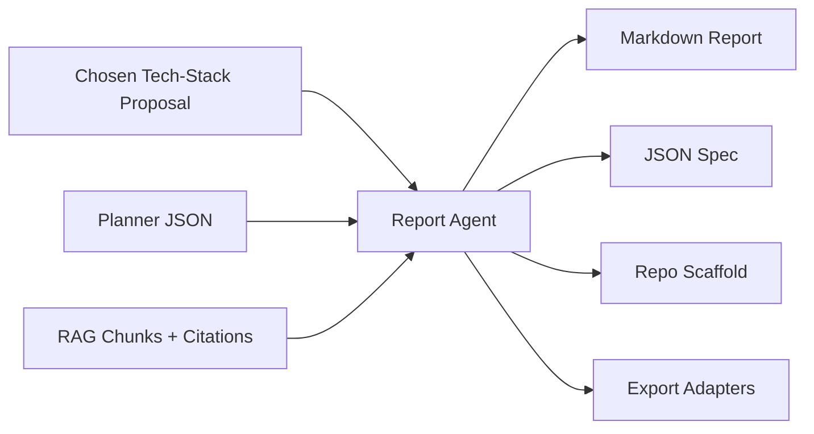

# Report Agent

_Status: Draft — last updated 2025-06-20_  
The **Report Agent** (RA) is the final step in Stack Composer’s pipeline.  
It collates the selected tech‑stack proposal, plan timelines, evidence
citations, and expert rationale into both human‑friendly and machine‑readable
artefacts. It can also scaffold a starter repository complete with CI, Docker,
and documentation.

---

## 1 Responsibilities

| #   | Responsibility               | Detail                                            |
| --- | ---------------------------- | ------------------------------------------------- |
| 1   | **Render human report**      | Markdown (UI preview), optional PDF/DOCX export   |
| 2   | **Emit machine spec**        | JSON (versioned schema) consumed by CI/CD         |
| 3   | **Generate scaffold**        | Directory tree, `README`, `Dockerfile`, workflows |
| 4   | **Citations & traceability** | Inline ⧉ links resolve back to RAG chunks         |
| 5   | **Export via adapters**      | GitHub push, Zip archive, DevContainer            |
| 6   | **Post‑generation hooks**    | Invoke user scripts / plugins after export        |

---

## 2 Data Flow



---

## 3 Public API

```rust
pub struct ReportRequest {
    pub proposal: Proposal,
    pub plan: Vec<PlanStep>,
}

pub struct ReportArtifacts {
    pub markdown_path: PathBuf,
    pub json_path: PathBuf,
    pub scaffold_dir: Option<PathBuf>,
}

#[async_trait]
pub trait ReportAgent {
    async fn generate(req: ReportRequest) -> anyhow::Result<ReportArtifacts>;
    async fn export(art: &ReportArtifacts, target: ExportTarget) -> anyhow::Result<()>;
}
```

_`ExportTarget` = `GitHubRepo { token, repo } | Zip | FileSystem(PathBuf)`._

---

## 4 Report Template (v0 .5)

1. **Executive Summary** – 1‑paragraph tl;dr
2. **Stack Radar** – SVG radar chart of language, framework, infra scores
3. **Plan Timeline** – Table + optional Gantt (if temporal plan)
4. **Licence & Security Matrix** – SPDX id, CVSS scores
5. **Scaffold Overview** – Tree view snippet
6. **Rationale & Citations** – Collapsible sections with ⧉ links

Templates stored in `templates/report_v05/*.tera` (Tera syntax).

---

## 5 Scaffold Generator

- **Directory renderer** – uses `liquid` templates so plugin can override.
- Default scaffold structure:

```
scaffold/
├─ README.md
├─ docker/
│  └─ Dockerfile
├─ .github/workflows/
│  └─ ci.yml
└─ src/
```

- Permissions: `chmod +x scripts/*.sh` during generation.
- CI workflow uses Node or Rust template based on stack choice.

---

## 6 Export Adapters

| Adapter          | Capabilities                                    |
| ---------------- | ----------------------------------------------- |
| **GitHubPush**   | Create repo, push scaffold, open PR with report |
| **ZipArchive**   | Compress scaffold + report; downloads via UI    |
| **DevContainer** | Emits `.devcontainer/devcontainer.json`         |

Adapters register via WASI plugin: `export(target, artifacts) -> Result`.

---

## 7 Configuration (`report.toml`)

```toml
[report]
default_format = "markdown"
include_citations = true
scaffold = true

[export]
default_target = "zip"
github_org = "my-org"
```

---

## 8 UI/UX Integration

- Wizard final screen shows **Preview** tabs (Report · JSON · Scaffold).
- **Download** dropdown picks format/target.
- “Push to GitHub” button asks for PAT; stored in OS keychain.

---

## 9 Security

- Sanitises any Markdown to avoid XSS in webview.
- GitHub token stored using `keyring` crate; never written to disk.
- Scaffold repo uses Apache‑2.0 licence file by default.

---

## 10 Roadmap

| Version | Feature                                  |
| ------- | ---------------------------------------- |
| 0.5     | Markdown + JSON + Zip export (this spec) |
| 0.8     | GitHubPush adapter, PDF (wkhtmltopdf)    |
| 1.0     | Confluence / Jira connectors             |
| 1.1     | Custom template marketplace              |
| 2.0     | Multilingual report rendering            |

---

## 11 Open Questions

- Which PDF engine gives best accessibility tags?
- How to diff scaffold updates on re‑generation?
- Should export adapters be allowed network in offline mode?

---

## 12 Usage Example

```rust
let req = ReportRequest { proposal, plan };
let artifacts = report_agent.generate(req).await?;
report_agent.export(&artifacts, ExportTarget::Zip)?;
```

---

See also:

- [Stack Agent](stack-agent.md)
- [Planner Adapter](planner-adapter.md)
- [Plugin SDK](../plugin-sdk/README.md)
