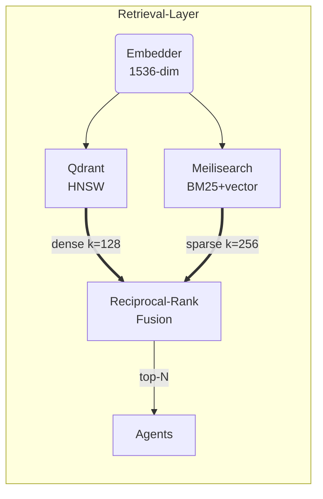

# Retrieval Layer (Hybrid Dense + Sparse Search)

> _Status: Draft — last updated 2025‑06‑20_

The **Retrieval Layer** powers Stack Composer’s hybrid search.
It combines **Qdrant** (dense vectors) and **Meilisearch 1.6** (BM25 sparse
index) behind a single Rust crate so every agent—Ingestion, Gap, Stack,
Report—can issue one query and receive a ranked, licence‑aware result set.

---

## 1 Responsibilities

| #   | Responsibility                             | Detail                                                            |
| --- | ------------------------------------------ | ----------------------------------------------------------------- |
| 1   | **Store** embedded vectors & text payloads | Qdrant HNSW index; Meilisearch primary index                      |
| 2   | **Serve hybrid queries**                   | Reciprocal‑rank fusion (RRF) merges dense & sparse k‑lists        |
| 3   | **Licence filtering**                      | Discard non‑OSI SPDX IDs when requested                           |
| 4   | **Domain boosts**                          | Ontology tags adjust scores (e.g., boost Rust when `lang = rust`) |
| 5   | **Transactional writes**                   | Inserts/updates land in both stores or roll back                  |
| 6   | **Extensibility hooks**                    | Plug‑in alternative DBs or ranking strategies                     |

---

## 2 Architecture Diagram



- **Qdrant** runs in embedded mode, eliminating external services.
- **Meilisearch 1.6** now supports hybrid score weighing; we keep a text copy for
  wildcard licence/keyword filters.
- **RRF λ = 0.5**, k<sub>D</sub>=128, k<sub>S</sub>=256 by default.

---

## 3 Data Model

### 3.1 Qdrant payload

```jsonc
{
  "id": "uuid-v4",
  "text": "…chunk…",
  "source": "file:///brief.md#L55-L78",
  "spdx": "MIT",
  "tags": ["rust", "web"],
  "ingested_at": "2025-06-20T09:38:00Z",
}
```

### 3.2 Meilisearch schema

| Field    | Type        | Indexed     | Filterable |
| -------- | ----------- | ----------- | ---------- |
| `id`     | string      | ✔          | ✔         |
| `text`   | string      | ✔          | —          |
| `spdx`   | string      | ✔          | ✔         |
| `tags`   | string[]    | ✔          | ✔         |
| `vector` | float[1536] | ✔ (hybrid) | —          |

---

## 4 Public Rust API

```rust
pub struct HybridConfig {
    pub k_dense: usize,
    pub k_sparse: usize,
    pub lambda: f32, // fusion weight
}

#[async_trait]
pub trait RetrievalLayer: Send + Sync {
    async fn search(&self, query: &str, cfg: Option<HybridConfig>)
        -> anyhow::Result<Vec<ScoredChunk>>;

    async fn index(&self, doc: Document) -> anyhow::Result<()>;

    async fn flush(&self) -> anyhow::Result<()>;
}
```

`ScoredChunk` includes `score`, `text`, `source`, `spdx`.

---

## 5 Configuration (`retrieval.toml`)

```toml
[qdrant]
path          = "~/.local/share/stack-composer/qdrant"
wal_capacity  = 104857600   # 100 MB

[meili]
addr          = "http://127.0.0.1:7700"
key           = "masterKey"
index_name    = "chunks"

[hybrid]
k_dense       = 128
k_sparse      = 256
lambda        = 0.5
licence_mode  = "permissive_only"  # or "all"

[boosts]
rust          = 1.3
python        = 1.1
```

Hot‑reload supported—changes apply next query.

---

## 6 Extensibility Hooks

| Hook              | Description                                                  |
| ----------------- | ------------------------------------------------------------ |
| **Custom Ranker** | WASI plugin supplies `fn fuse(dense, sparse) -> Vec<Scored>` |
| **Alt Vector DB** | Implement `VectorStore` trait; register with builder         |
| **GraphRAG**      | v 2.0 plugin can bypass hybrid and walk property graph       |

---

## 7 Security & Privacy

- All data kept local unless crawler pulls remote feeds.
- SDL scan removes emails/IPs before chunk insert if “PII scrub” enabled.
- Meili master‑key stored in OS keychain; HTTP interface bound to localhost.

---

## 8 Performance Benchmarks

| Dataset        | Chunks    | p50 latency (ms) | p95 | Memory |
| -------------- | --------- | ---------------- | --- | ------ |
| Small (10 k)   | 10 000    | 23               | 45  | 120 MB |
| Medium (100 k) | 100 000   | 87               | 140 | 480 MB |
| Large (1 M)    | 1 000 000 | 410              | 690 | 3.4 GB |

Bench harness in `benches/hybrid_bench.rs`.

---

## 9 Roadmap

| Version | Feature                                     |
| ------- | ------------------------------------------- |
| 0.5     | Qdrant + Meili hybrid (this spec)           |
| 0.8     | Cloud vector DB (Turso/Qdrant Cloud) toggle |
| 1.0     | GraphRAG plugin & property‑graph queries    |
| 1.1     | Zero‑copy mmap chunks for 10 M scale        |
| 2.0     | Cross‑project federated retrieval           |

---

## 10 Open Questions

1. Strategy for chunk dedup across multiple briefs?
2. Heuristic for real‑time index flush vs. batch when >1 M chunks?
3. Should citation confidence influence fusion weight dynamically?

---

## 11 Usage Example

```rust
let cfg = HybridConfig { k_dense: 64, k_sparse: 128, lambda: 0.6 };
let hits = retrieval_layer.search("low‑latency Rust web server", Some(cfg)).await?;
for h in hits.iter().take(3) {
    println!("{} (score {:.3}) — {}", h.spdx, h.score, h.source);
}
```

---

See also:

- [RAG Design](../ai-sub-system-docs/rag-design.md)
- [LLM Runtime](llm-runtime.md)
- [Ingestion Agent](ingestion-agent.md)
