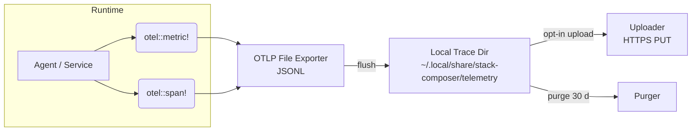

# Telemetry Pipeline

_Status: Draft — last updated 2025-06-20_  
The **Telemetry Pipeline** provides observability into Stack Composer while
respecting the project’s strict **privacy-first** stance. By default, all
metrics and traces are kept **locally** as JSON files and auto‑purged after
30 days. Users may opt‑in to upload anonymised bundles to a remote collector.

---

## 1 Responsibilities

| #   | Responsibility                | Detail                                            |
| --- | ----------------------------- | ------------------------------------------------- |
| 1   | **Collect spans & metrics**   | OpenTelemetry Rust SDK (v0.22)                    |
| 2   | **Write local trace bundles** | OTLP file exporter → `.jsonl`                     |
| 3   | **Retention & purge**         | Cron deletes files >30 days or on‑demand          |
| 4   | **Manual upload**             | Compress + POST to remote Jaeger/Tempo            |
| 5   | **Privacy guardrails**        | Hash project IDs; never log brief content         |
| 6   | **Plugin hooks**              | WASI plugins may record custom events via host fn |

---

## 2 Architecture Diagram



---

## 3 Data Model

### 3.1 Metric Record

```jsonc
{
  "timestamp": "2025-06-20T12:00:01Z",
  "metric": "agent.latency_ms",
  "value": 123,
  "labels": { "agent": "stack", "phase": "score" },
}
```

### 3.2 Span Record

```jsonc
{
  "trace_id": "b17f…",
  "span_id": "9c2a…",
  "parent_id": null,
  "name": "retrieval.search",
  "start_ns": 282917333,
  "end_ns": 283020999,
  "attrs": { "k_dense": 128, "k_sparse": 256 },
}
```

Project identifiers are SHA‑256 hashed before writing.

---

## 4 Public API

```rust
pub enum TelemetryEvent {
    Metric { name: &'static str, value: f64, labels: Labels },
    SpanStart { name: &'static str },
    SpanEnd,
}

pub trait Telemetry {
    fn record_event(&self, ev: TelemetryEvent);
    fn flush(&self) -> anyhow::Result<PathBuf>;  // returns path of flushed file
}
```

A global `TELEMETRY` sink is set up during orchestrator bootstrap.

---

## 5 Configuration (`telemetry.toml`)

```toml
[telemetry]
enabled = true
exporter = "file"          # file | stdout | otlp_http
local_retention_days = 30
upload_enabled = false

[upload]
endpoint = "https://jaeger.my-org.com/api/traces"
compression = "gzip"
```

Changes hot‑reload; disabling telemetry stops new writes but keeps files until purge.

---

## 6 Security & Privacy

| Concern        | Mitigation                                                                    |
| -------------- | ----------------------------------------------------------------------------- |
| PII leakage    | Redact e‑mails, tokens via regex; hashes instead of raw IDs                   |
| Data at rest   | File permissions `600`; optional AES‑256 via OS keychain (v1.0)               |
| Network egress | Upload only if `upload_enabled = true`; proxy honours `HTTPS_PROXY`           |
| Plugin abuse   | Plugins limited to `telemetry.log(level, msg)` unless `telemetry` cap present |

GDPR toggle (`--gdpr`) disables telemetry entirely and purges traces after each stack generation.

---

## 7 Dashboards

- **Grafana** datasource preset JSON under `dashboards/telemetry_grafana.json`
  - Panels: agent latency p95, retrieval qps, planner success %, critic value heatmap.
- **CLI**: `stack-composer stats --since 24h` prints key counters.

---

## 8 Extension Hooks

| Hook               | Description                                        |
| ------------------ | -------------------------------------------------- |
| **New exporter**   | WASI plugin implements `export(path) -> Result`    |
| **Custom event**   | Plugin calls `host_telemetry_event(json_ptr, len)` |
| **Real‑time push** | gRPC streaming exporter planned v1.1               |

---

## 9 Roadmap

| Version | Feature                                  |
| ------- | ---------------------------------------- |
| 0.5     | File exporter, manual upload, purge UI   |
| 0.8     | Prometheus exporter for live Grafana     |
| 1.0     | Encrypted trace store (sqlcipher)        |
| 1.1     | gRPC streaming to Tempo, alert hooks     |
| 2.0     | Differential‑privacy metrics aggregation |

---

## 10 Usage Examples

### 10.1 Record Span

```rust
let _span = telemetry::span!("planner.solve");
planner.solve(...).await?;
```

### 10.2 Manual Upload

```bash
stack-composer telemetry upload --since 7d
```

### 10.3 Purge Now

```bash
stack-composer telemetry purge
```

---

## 11 Open Questions

- Should per‑user metrics be aggregated before upload for extra anonymity?
- Auto‑throttle file size when disk < 1 GB?
- Provide “share debug bundle” CLI for bug reports?

---

See also:

- [Plugin Host](plugin-host.md)
- [Ops Guide](../operations/ops-guide.md)
- [Orchestrator](orchestrator.md)
