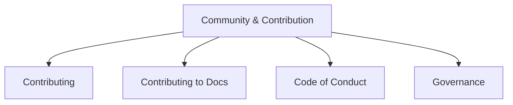

# Community & Contribution

Get involved with Stack Composer! Learn how to contribute, follow our code of conduct, and join the community.

## Section Structure

## Key Guides

- [Contributing](../CONTRIBUTING.md): How to contribute code or ideas.
- [Contributing to Docs](../contributing-to-docs.md): Improve our documentation.
- [Code of Conduct](../CODE_OF_CONDUCT.md): Community standards.
- [Governance](../MAINTAINERS.md): Project governance and maintainers.

---

**Next Steps:**

- Explore [User Guides](../configuration.md) to get started.
- Learn about [Extensibility](../plugin-sdk/README.md) to build plugins.
