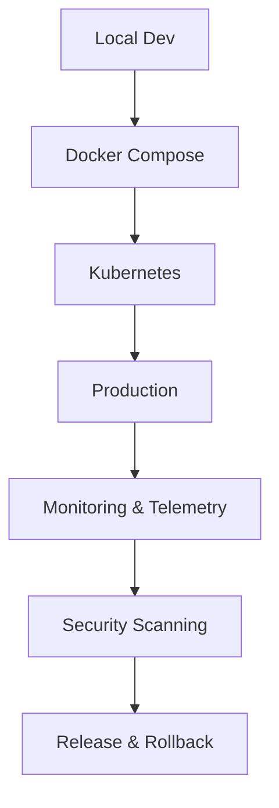

# Operations Guide

For reproducible local operations, see [Toolchain & DX Pipeline](../toolchain.md) and [Developer Setup](../developer-extensibility-docs/dev-setup.md) for Docker, Nix, and all required tools.

---

## Deployment Workflow



- Qdrant runs via Docker for local development.
- Use `trivy` for container and SBOM health/security checks.
- Nix enables reproducible ops environments.

---

## Local Deployment: Docker Compose Example

```yaml
version: '3.8'
services:
  qdrant:
    image: qdrant/qdrant:v1.4
    ports: ['6333:6333']
    volumes:
      - qdrant_data:/qdrant/storage
  meilisearch:
    image: getmeili/meilisearch:v1.5
    ports: ['7700:7700']
    environment:
      - MEILI_NO_ANALYTICS=true
  stack-composer:
    build: .
    depends_on:
      - qdrant
      - meilisearch
    environment:
      - QDRANT_URL=http://qdrant:6333
      - MEILI_URL=http://meilisearch:7700
volumes:
  qdrant_data:
```

---

## Production: Kubernetes Snippet

```yaml
apiVersion: apps/v1
kind: Deployment
metadata:
  name: stack-composer
spec:
  replicas: 2
  selector:
    matchLabels:
      app: stack-composer
  template:
    metadata:
      labels:
        app: stack-composer
    spec:
      containers:
        - name: stack-composer
          image: ghcr.io/your-org/stack-composer:latest
          ports:
            - containerPort: 8080
          env:
            - name: QDRANT_URL
              value: http://qdrant:6333
            - name: MEILI_URL
              value: http://meilisearch:7700
```

---

**Next Steps:**

- Review [Security Policy](security-policy.md)
- See [Telemetry & Privacy](../operations/telemetry-privacy.md)
- Explore [Release Process](../release-engineering/release-process.md)
