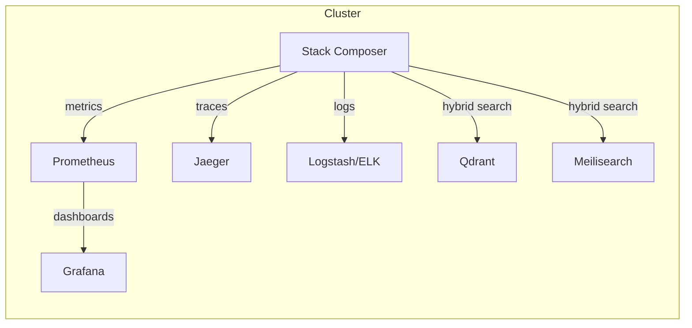

# Operations Guide

For reproducible local operations, see [Toolchain & DX Pipeline](../toolchain.md) and [Developer Setup](../../developer-extensibility-docs/dev-setup.md) for Docker, Nix, and all required tools.

- Qdrant runs via Docker for local development.
- Use `trivy` for container and SBOM health/security checks.
- Nix enables reproducible ops environments.

---

## Local Deployment: Docker Compose Example

```yaml
version: '3.8'
services:
  qdrant:
    image: qdrant/qdrant:v1.4
    ports: ['6333:6333']
    volumes:
      - qdrant_data:/qdrant/storage
  meilisearch:
    image: getmeili/meilisearch:v1.5
    ports: ['7700:7700']
    environment:
      - MEILI_NO_ANALYTICS=true
  stack-composer:
    build: .
    depends_on:
      - qdrant
      - meilisearch
    environment:
      - QDRANT_URL=http://qdrant:6333
      - MEILI_URL=http://meilisearch:7700
volumes:
  qdrant_data:
```

---

## Production: Kubernetes Snippet

```yaml
apiVersion: apps/v1
kind: Deployment
metadata:
  name: stack-composer
spec:
  replicas: 2
  selector:
    matchLabels:
      app: stack-composer
  template:
    metadata:
      labels:
        app: stack-composer
    spec:
      containers:
        - name: stack-composer
          image: ghcr.io/your-org/stack-composer:latest
          ports:
            - containerPort: 8080
          readinessProbe:
            httpGet:
              path: /healthz
              port: 8080
            initialDelaySeconds: 5
            periodSeconds: 10
          livenessProbe:
            httpGet:
              path: /livez
              port: 8080
            initialDelaySeconds: 10
            periodSeconds: 30
```

---

## Health & Metrics Endpoints

- `/healthz` – Readiness probe (returns 200 if ready)
- `/livez` – Liveness probe (returns 200 if alive)
- `/metrics` – Prometheus metrics endpoint

---

## Observability Stack

- **Prometheus**: Scrapes `/metrics` for system and app metrics.
- **Grafana**: Dashboards for latency, throughput, error rates.
- **Jaeger**: Distributed tracing via OpenTelemetry.
- **ELK/OpenSearch**: Structured log aggregation and search.
- **Alerting**: Example Prometheus rule:

```yaml
- alert: HighPlanLatency
  expr: plan_latency_seconds > 5
  for: 5m
  labels:
    severity: warning
  annotations:
    summary: 'Plan latency is high (>5s)'
```

---

## Topology Diagram



---

## Ontology Crawler & Health Checks

- Ontology crawler runs weekly to refresh the knowledge base.
- Health checks: `/healthz`, `/livez`, and `/metrics` endpoints for monitoring and alerting.
