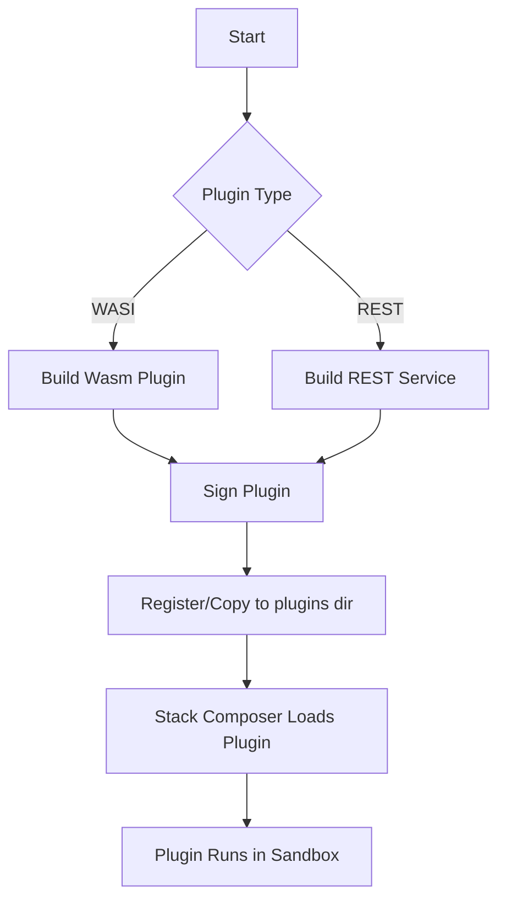

# Plugin SDK

A complete guide for extending **Stack Composer** with first‑class plugins. All examples compile on macOS, Linux and Windows and assume Rust 1.79+, Node 20+ and Wasmtime >= 1.0.

---

## Plugin Types & Lifecycle



---

## 1. Scope

This SDK **covers every officially‑supported integration style**, not just WASI:

| Plugin type          | Typical use                                          | Transport                | Runtime                           |
| -------------------- | ---------------------------------------------------- | ------------------------ | --------------------------------- |
| **WASI (preferred)** | Low‑latency extensions that need direct host calls   | Host → `wasmtime` → Wasm | Rust, Zig, TinyGo, AssemblyScript |
| **REST / gRPC**      | Language‑agnostic micro‑services on localhost or LAN | HTTP 1.1 / HTTP 2        | Any language / container          |
| **Future adapters**  | Experimental host functions, GraphRAG walkers, etc.  | TBD                      | To be defined via ADR             |

The SDK shows how to write, test, sign and distribute each kind, but **WASI is the canonical path** for sandboxed, offline‑first plugins.

---

## 2. Quick Start (WASI Hello World)

```bash
cargo new --lib hello_plugin
cd hello_plugin
# Add Wasmtime & SDK helpers
cargo add wit-bindgen = "0.16" wasmtime = "18"
```

```rust
// src/lib.rs
use exports::stack_composer::plugin::v1::*;
use stack_composer_sdk::host;

struct Plugin;
impl PluginApi for Plugin {
    fn name() -> String { "hello-plugin".into() }
    fn run(input: String) -> Result<String, String> {
        host::log(&format!("received: {input}"));
        Ok(format!("Echo: {input}"))
    }
}
```

```bash
# Build Wasm
cargo wasi build --release
```

Copy the resulting **`hello_plugin.wasm`** and **`hello_plugin.sig`** (see §5) into  
`~/.local/share/stack-composer/plugins/`.

---

## 3. Quick Start (REST Plugin)

```bash
# Example: Node.js REST plugin
mkdir rest_plugin && cd rest_plugin
pnpm init && pnpm add express
```

```javascript
// index.js
const { createServer } = require('http');
const { parse } = require('url');
const { StackComposer } = require('stack-composer-sdk');

const server = createServer((req, res) => {
  const { pathname } = parse(req.url);
  if (pathname === '/run') {
    let body = '';
    req.on('data', (chunk) => {
      body += chunk;
    });
    req.on('end', () => {
      const result = StackComposer.run('hello-plugin', body);
      res.writeHead(200, { 'Content-Type': 'text/plain' });
      res.end(result);
    });
  } else {
    res.writeHead(404);
    res.end();
  }
});

server.listen(3000);
console.log('Server running at http://localhost:3000/');
```

Run the server with:

```bash
node index.js
```

Test it with:

```bash
curl -X POST -d 'World' http://localhost:3000/run
```

---

## 4. Plugin Types

### 4.1. WASI Plugins

WASI plugins are the most powerful and flexible, allowing direct interaction with the host environment. They are written in languages that compile to WebAssembly, like Rust, Zig, or AssemblyScript.

#### 4.1.1. Example: Rust WASI Plugin

```rust
// src/lib.rs
use exports::stack_composer::plugin::v1::*;
use stack_composer_sdk::host;

struct Plugin;
impl PluginApi for Plugin {
    fn name() -> String { "rust-wasi-plugin".into() }
    fn run(input: String) -> Result<String, String> {
        host::log(&format!("Rust received: {input}"));
        Ok(format!("Rust Echo: {input}"))
    }
}
```

Build and install as in §2.

### 4.2. REST Plugins

REST plugins are language-agnostic and can be written in any language that supports HTTP, like JavaScript (Node.js), Python, or Go. They communicate over HTTP/1.1 or HTTP/2.

#### 4.2.1. Example: Python REST Plugin

```python
# server.py
from http.server import BaseHTTPRequestHandler, HTTPServer
from stack_composer_sdk import StackComposer

class RequestHandler(BaseHTTPRequestHandler):
    def do_POST(self):
        if self.path == '/run':
            content_length = int(self.headers['Content-Length'])
            body = self.rfile.read(content_length).decode('utf-8')
            result = StackComposer.run('hello-plugin', body)
            self.send_response(200)
            self.send_header('Content-type', 'text/plain')
            self.end_headers()
            self.wfile.write(result.encode('utf-8'))
        else:
            self.send_response(404)
            self.end_headers()

httpd = HTTPServer(('localhost', 3000), RequestHandler)
print("Server running at http://localhost:3000/")
httpd.serve_forever()
```

Run the server with:

```bash
python server.py
```

Test it with:

```bash
curl -X POST -d 'World' http://localhost:3000/run
```

---

## 5. Testing and Signing

Plugins must be tested and signed before distribution. The SDK provides tools for:

- Unit and integration testing
- Benchmarking
- Signing with a developer key

See the **Testing** and **Signing** sections for detailed instructions.

---

## 6. Distribution

Distribute your plugins via:

- Direct file distribution (`.wasm` + `.sig`)
- Private or public plugin repositories

Refer to the **Distribution** section for best practices and tools.

---

## 7. Advanced Topics

Explore advanced topics like:

- Performance optimization
- Security best practices
- Debugging and logging

See the **Advanced Topics** section for in-depth guides.

---

## 8. FAQ

Find answers to common questions about:

- Plugin development
- Troubleshooting
- SDK features

Check the **FAQ** section for quick help.

---

## 9. Resources

Access additional resources:

- Official documentation
- Community forums
- Example projects

Visit the **Resources** section for more information.

---

## 10. Changelog

Keep track of changes to the SDK, including:

- New features
- Bug fixes
- Breaking changes

See the **Changelog** section for the full history.

---

## 11. Support

Get support for the SDK through:

- GitHub issues
- Community forums
- Official support channels

Refer to the **Support** section for assistance.

---

## 12. Contributing

Contribute to the SDK by:

- Reporting issues
- Submitting pull requests
- Suggesting features

Check the **Contributing** section for guidelines.

---

## 13. License

The SDK is licensed under the [MIT License](LICENSE).

---

## 14. Acknowledgements

Thanks to all contributors and the open-source community for their support and feedback.

---

## 15. Contact

For questions or feedback, contact the SDK team at [sdk-team@example.com](mailto:sdk-team@example.com).

---

End of SDK documentation.
