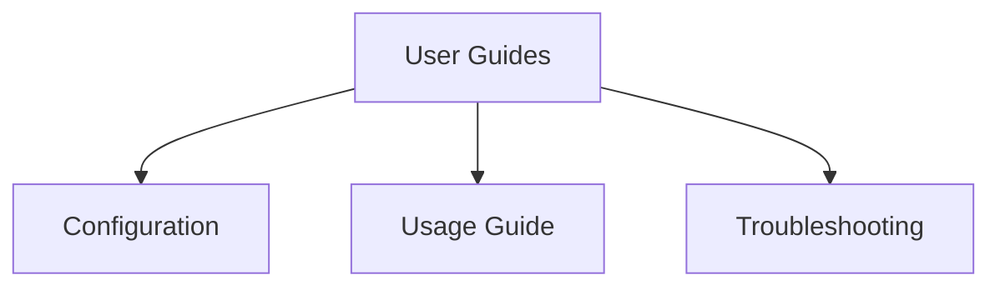

# User Guides

This section provides practical guides for configuring, using, and troubleshooting Stack Composer.

## Section Structure

## Key Guides

- [Configuration](../configuration.md): How to configure Stack Composer for your needs.
- [Usage Guide](usage.md): In-depth usage instructions and tips.
- [Troubleshooting](troubleshooting.md): Solutions to common issues.

---

**Next Steps:**

- Explore [Extensibility](../plugin-sdk/README.md) to customize Stack Composer.
- Review [Operations & Security](../operations/ops-guide.md) for deployment and security best practices.
